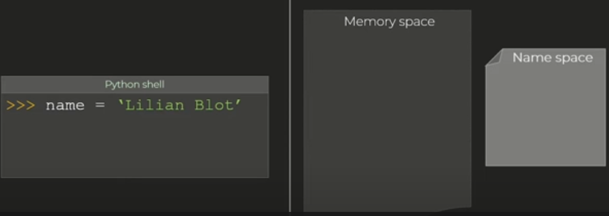
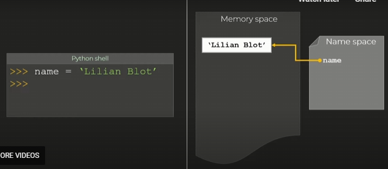
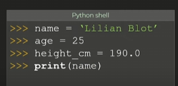
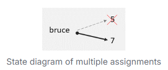
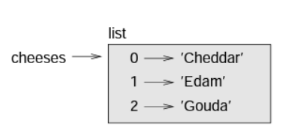

# Values, types and variables

A value can be a int, number, string, boolean etc. These are different classes.

Can use type() to figure out the type in python

`type('magical string')`
<\class 'str'>\

## Floats

1.0, 0.11, - 0.111
called a float because the decimal can be anywhere on the number.

## Ints

Contain no decimal points. Also leading 0s will give a syntax error.

zipcode = 02492
SyntaxError: leading zeros in decimal integer literals are not permitted; use an 0o prefix for octal integers

## Strings

'17' is a string because it is in quotations.

# Variables

variable_name = value

= is the asignment operator.

== is the equality operator.

When representing this on paper we use arrows

for instance...

name -> 'fred'

Above is referred to as a **state diagram**



The assignment operator works right to left. So it stores the value in the memory space. The name gets added to the name space. Finally the value is assigned to the name.



Note: Arrow is pointing from name to the value.



Above the interpreter sees the print statement and looks for 'name' in the name space.

If name is in the name space then it fetches the value referenced by the variable.

The interpreter replaces the name with its value so it prints out the value.

## Variable names

- Can only start with a letter or an underscore.

- Can contain numbers at the end or middle or end

- It is case sensitive

- no white space allowed.

- Better be longer and more descriptive.

- snake case
e.g. book_name

Python has some reserved keywords you can't use for your variable names.

## Multiple assignment

```
age = 5
print(age)
age = 6
print(age)
```

Here there is no error when we reassign age to 6.



## Updating variables

Can modify a variable like this

```
x = 6
x = x + 1
```

This only works when x is already defined. As python assignment operator does the right side first it'll have no idea what x is otherwise.

## Strings

```
name = 'george'
second_letter = george[1]
```

- That second line uses indexing to get the second character. (will get e instead of g)
- Indexes start form 0 so index of 1 gets the second character.
- Indexes must be an integer. Trying to grab 2.5 index will throw an error.

## String slices

Taking a segment of a string is a slice.

```
my_string = 'Arshad'
print(my_string[0:3])
```
Expected output: 'Ars'

First index shows where to start and the second shows where to end. Note the ending isn't included.

e.g. Index 3 is 'h' but isn't in the slice.

Omitting first number starts slice from the beginning.

`my_string[:3] -> 'Ars'`

Omittting last number ends slice at the end.

`my_string[3:] -> 'had'`

when the first index is greater then or equal to the second then you get an empty string as nothing occupies that gap.

Conversely when there is no indexes supplied you get the full string.

` my_string[:] -> 'Arshad'`

## Mutability

Strings are immutable so can't be changed. Closest behaviour is replacing the string entirely

```
test_string = 'fred'
test_string[1] = 'z'
```

Above will throw an error.

``` test_string = 'fzed' ```

This will do the intended behaviour.

``` new_string = test_string[0] + z + test_string[2:]```

Above is another spicy way.

## Lists

Similar to strings in that it is a sequence of values except each value can be of a different type.

```
data = ['fred', 12, True]
```

You can nest lists and access the contents of nested lists using like this...

```
data = [[12,4], 'hello']

print(data[0,1])
```

output -> 4

Lists can also be empty just like a string can. It'll just have a length of 0.

### Mutability

Mutable unlike strings.



When showing lists you use a box and put the key value pairs in them.

## Negative indices

Putting in a negative number counts backwarsd through the list. So -1 would get you the final element.

## Slicing

You can slice it the same way as strings.

When mutilating a list is recommended to keep copies. Creating a full slice with [:] is an easy way of doing that.

# Tuples

Like a list but immutable.

fred = a, b

jam = a,