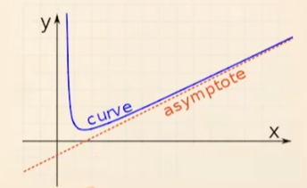
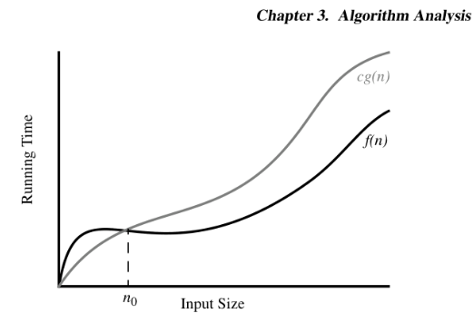

# Asymptotic analysis and Big O notation

In asymptotic analysis we look at factors that determine **growth rate** of an algorithm as opposed to looking at the actual number of operations occuring.

We can assume each step written from our high level language/ pseudo code only matters for small amount of operations anyways so we generalise them to have the same running time cost.

Helpful [video](https://www.youtube.com/watch?v=0oDAlMwTrLo) I found

**Asymptotes**: A line where a function is  are very close to touching but will never quite. As the input size gets larger, it gets closer and closer to becoming this line.



Some algorithms may run faster initially but then tend towards a particular asymptote. Its a great way to compare algorithms.

e.g. It is not about how you start but how you **end** when comparing efficiency of algorithms.

## 3.3.1 The Big-Oh Notation

Example
- f(n) and g(n) are both functions that take integers to produce real positive numbers.
- We're trying to justify g(n) as an upperbound of f(n).

f(n) <= cg(n)

or..

f(n) **is** O(g(n))

Saying a function is big O of another means that it is less than the other one.



When looking at the graph there is a point where the functions trade efficiencies. This is denoted as n~0~. We're saying that f(n) is O(g(n)) when n > n~0~.

n > n~0~ is important to clarify as we can see that below this number f(n) isn't O(g(n)).

> f(n) is O(g(n)) when n >= 1 and c > 0

We set c at a value so that g(n) remains above f(n) at all times so we can use that as an upper bound.
## How to use Big O

- Big O let's us **ignore** constants and lower-order terms to focus on the main thing causing growth. For instance...

```
3n^9^ + 9n^3^ + 12

f(n) is O(n^9^)

```
- 3, 9 and 12 are constants so get ignored.
- n^3^ and 12 are lower order terms so are ignored as well.
- That just leaves n^9^ as the most significant thing driving growth.
- Always best to give big O as accurate as possible. We can overshoot and it'd still be correct like saying f(n) is O(n^100^) for the above example. Although it isn't very helpful so should be avoided.
- The highest degree term in a polynomial determines asymptotic growth rate of that polynomial.
- It is also important to give big O as simple as possible ignoring constants and lower order terms.

## Big Omega Ω

- Way of saying, asymptotically, that a function is greater than or equal to another.

## Big Theta Θ
- Says that two functions grow at the same rate up.

# Asymptotic analysis

Even if we speed up hardware dramatically we're still burdened by an asymptoticly slow algorithm.

However Big O isn't the end all be all.

10^100^n is technically O(n) but is worse than n^2^ for a lot of practical cases.

Bear in mind that Big O hides some things and we shouldn't always ignore constants and lower order terms etc

## Constant Time Operations O(1)

- Note we're using Python and data is a list

`len(data)`

Above is constant time as the list class stores length as a variable for instant access.

No matter how long the list gets, the amount of operations required to get length stays the same.

O(1)

Accessing an index from an array is also O(1) as the elements are stored contiguously in memory. We can just jump to the index we want instead of iterating through each element.

> Reached page 131