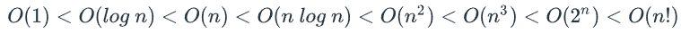

# RAM Model of Computation and Big O Notation

## Introduction

* A practical method for evaluating how long an algorithm will take to run.
* Assumes each basic operation (e.g., addition, comparison) takes roughly the same amount of time.
* Focuses on how **input size** affects performance, enabling algorithm comparisons independent of hardware/software specifics.
* We’ll also cover **Big O notation**, a concise way to describe how input growth affects performance.

---

## 3.3.1 The Motivation Behind the RAM Model

### Experimental Approach (Alternative)

* Involves benchmarking algorithms on real-world systems.
* Results vary significantly across different hardware setups.
* Factors such as **cache size**, **memory hierarchy**, and **software environments** influence performance.
* Makes it difficult to draw universal conclusions.

### Why Use RAM Model?

* Eliminates dependency on specific hardware.
* Allows **universal comparisons** between algorithms.
* Enables use of **asymptotic analysis** to evaluate growth patterns as inputs approach infinity.

---

## RAM: The Random Access Machine Model

A highly abstract, idealized model used for analyzing algorithms.

### Key Properties

* **Memory**: Infinite and flat; each memory access takes constant time (O(1)).
* **Processor**: Executes instructions sequentially; every instruction takes equal time.
* **Instruction Set**: Basic operations such as load, store, add, subtract, branch.
* **Input/Output**: Inputs are read from memory; outputs are written back to memory.

---

## Benefits of RAM Abstraction

* Simplifies performance analysis.
* Avoids the need to account for hardware/software idiosyncrasies.
* Supports fair, **hardware-agnostic** comparisons.
* Makes theoretical predictions about scalability more consistent.

---

## Limitations of the RAM Model

* **Unrealistic assumptions**:

  * Infinite memory.
  * Uniform memory access speed (ignores cache, disk, etc.).
* **No hardware constraints** such as memory limits or parallel processing.

> For more accurate real-world predictions, **combine** RAM model analysis with empirical testing.

---

# 3.3.2 Exploration: 8 Useful Functions for Algorithm Analysis

## Slow Growth Rates

### Constant — \$f(n) = c\$

* Time doesn’t change with input size.
* **Examples**:

  * Accessing the first item in an array.
  * Splitting a list at a fixed index.

**Big O**: `O(1)`

---

### Logarithmic — \$f(n) = \log n\$

* Time increases very slowly as input grows.
* **Examples**:

  * Binary Search (divides input space in half each iteration).

**Big O**: `O(log n)`

---

## Moderate Growth Rates

### Linear — \$f(n) = n\$

* Time increases proportionally to input size.
* **Examples**:

  * Scanning through an array.

**Big O**: `O(n)`

---

### Log-linear — \$f(n) = n \log n\$

* Grows faster than linear, slower than quadratic.
* **Examples**:

  * Merge Sort
  * Quick Sort (on average)

**Big O**: `O(n log n)`

---

## Polynomial Growth Rates

### Quadratic — \$f(n) = n^2\$

* Often occurs with nested loops comparing all elements.
* **Examples**:

  * Insertion Sort
  * Selection Sort

**Big O**: `O(n^2)`

---

### Cubic — \$f(n) = n^3\$

* Triple nested loops; interactions among triples of input.
* **Example**:

  * Matrix multiplication (naïve approach)

**Big O**: `O(n^3)`

---

## Polynomial Functions

* Functions formed by sums of powers of `n` multiplied by constants.
* **Degree** = highest exponent.

  * Example: `f(n) = 4n^3 + n^2 + n + 7` → degree 3

**Note**: Constant and linear time are technically polynomial-time too (`O(1)` = `O(n^0)`, `O(n)` = `O(n^1)`)

---

## Non-Polynomial Growth Rates

### Exponential — \$f(n) = c^n\$

* Extremely fast growth.
* **Example**:

  * Brute-force solution to the Travelling Salesman Problem

**Big O**: `O(c^n)`

---

### Factorial — \$f(n) = n!\$

* Grows even faster than exponential.
* **Examples**:

  * Algorithms that check **every permutation**, such as brute-force solutions to scheduling problems.

**Big O**: `O(n!)`

---

## Handy Summary

---

## Reading: Why RAM Over Experimental Testing?

* Experimental testing is **hardware-specific** and not universally reliable.
* RAM provides a **neutral model** to analyze and compare algorithms independent of:

  * Processor architecture
  * Memory cache
  * Software environments

---

## Features of the RAM Model (Recap)

| Feature      | Description                                              |
| ------------ | -------------------------------------------------------- |
| Memory       | Infinite, flat, uniform access (O(1))                    |
| Processor    | Executes operations one at a time, each costing the same |
| Input/Output | Accessed via memory                                      |
| Instructions | Basic operations (load, store, add, branch)              |

---

## Summary of Tradeoffs

| Model            | Pros                               | Cons                                  |
| ---------------- | ---------------------------------- | ------------------------------------- |
| **RAM**          | Abstract, universal, enables Big O | Unrealistic assumptions               |
| **Experimental** | Real-world performance             | Hardware-dependent, not generalizable |