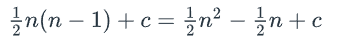

# Examples

## Insertion Sort


- Sorts an array by placing each unsorted element into its sorted position
- As the algorithm goes it shifts elements to the end to make space for smaller elements.
- 2 loops. Outer loop goes through each element in the array.
- Inner loop then compares the current element to all the previously looked at elements.

### Worst Case

- When input is unfortunately in reverse order.
- e.g...

`[5, 4, 3, 2, 1]`

- Each loop the current item has to go through 1 more comparison to make it to its correct position.

First step has 1 swap, step 2 has 2 swaps

1 + 2 + 3 + .... + (n-1)

- Fine for small data sets but it quickly balloons up

- It can also be used to sort things which are nearly sorted.

## Bubble Sort

```
BubbleSort(A, n):
    for i = 0 to n-2:
        for j = 0 to n-2-i:
            if A[j] > A[j+1]:
                Swap(A[j], A[j+1])
```
---
## Speculation from me could be wrong
> Above example looks incorrect as it uses n-2 but should really use n-1.

- Works by comparing elements 2 at a time and swapping them if they're in wrong order. It'll go around and around the sequence until the job is done.

- In above algorithm the outer loop terminates when you reach the second last element (wrong algorithm maybe)

- Inner loop, every iteration has a comparison and maybe a swap. Contents is O(1) but the loop is O(log(n)) **I think**. We get 1 less iteration of the inner loop every iteration of the outer loop.

- Outer loop is O(n). Altogether nlog(n)?

- Best case scenario seems to be unchaged as well because the loop goes to completion regardless. Making n larger means the loops compound on each other larger.
---
## Answers:

Outer loop runs for n-1 iterations. (indexing from 0 and stopping at n-2)

Inner loop runs with 1 less step per outter loop.

5 -> 4 -> 3 -> ...

Can represent that lessening as 1/2 * n (n - 1)

Each iteration of inner loop performs 1 comparison so we can say that the comparison occurs 1/2 * n(n-1) as well.

The swap may or may not occur depending on if the 2 elements are in order. In the worst case where every element swaps then that's 1/2 * n(n-1) as well

Other operations: Initalising variables and incrementing the loop counters happen per loop and don't affect the asymptotic complexity.

**Overall** we end up with..



c above is just a constant that accounts for the other basic operations that don't inflate with input size.

Above shows us what happens when we expand the brackets.

As we can see there is a quadratic term which is the highest order so we are left with O(n^2^)

## Asymptotic Analysis

Worst case scenario for bubble sort is when array is backwards. This leads to every element requiring a swap and we're left with O(n^2^)

Best case scenario the array is already sorted so Ω(n^2^)

## Reminder

🚦 Think of It Like This:
Big O (O): The maximum time an algorithm might take (worst case).

Big Omega (Ω): The minimum time an algorithm must take (best case).

Theta (Θ): The time the algorithm always takes (when best, average, and worst case all match up). Note when Big O and Big Omega are the same it doesn't automatically mean we have a big Theta

# Optimised Bubble Sort

- has a flag that when flipped terminates the algorithm early. This gets checked every loop and if no flips occur then the array is already sorted.

```python
OptimisedBubbleSort(A, n):
    for i = 0 to n-2:
        swapped = false
        for j = 0 to n-2-i:
            if A[j] > A[j+1]:
                Swap(A[j], A[j+1])
                swapped = true
        if not swapped:
            break
```
The outer loop now terminates early if swaps don't occur that iteration

new variable 'swapped' that gets assigned every loop at O(1)

There's also another conditional ran every loop at O(1)

The rest is the same at the worst case

Best case is Ω(n) as it still has to do 1 pass through of the array to check that it is in order.