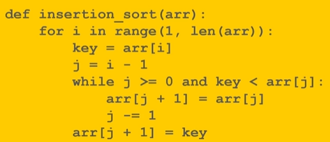

# Examples

## Insertion Sort



- Sorts an array by placing each unsorted element into its sorted position
- As the algorithm goes it shifts elements to the end to make space for smaller elements.
- 2 loops. Outer loop goes through each element in the array.
- Inner loop then compares the current element to all the previously looked at elements.

### Worst Case

- When input is unfortunately in reverse order.
- e.g...

`[5, 4, 3, 2, 1]`

- Each loop the current item has to go through 1 more comparison to make it to its correct position.

First step has 1 swap, step 2 has 2 swaps

1 + 2 + 3 + .... + (n-1)

- Fine for small data sets but it quickly balloons up

- It can also be used to sort things which are nearly sorted.

## Bubble Sort

```
BubbleSort(A, n):
    for i = 0 to n-2:
        for j = 0 to n-2-i:
            if A[j] > A[j+1]:
                Swap(A[j], A[j+1])
```
---
## Speculation from me could be wrong
- Works by comparing elements 2 at a time and swapping them if they're in wrong order. It'll go around and around the sequence until the job is done.

- In above algorithm the outer loop terminates when you reach the second last element

- Inner loop, every iteration has...
---