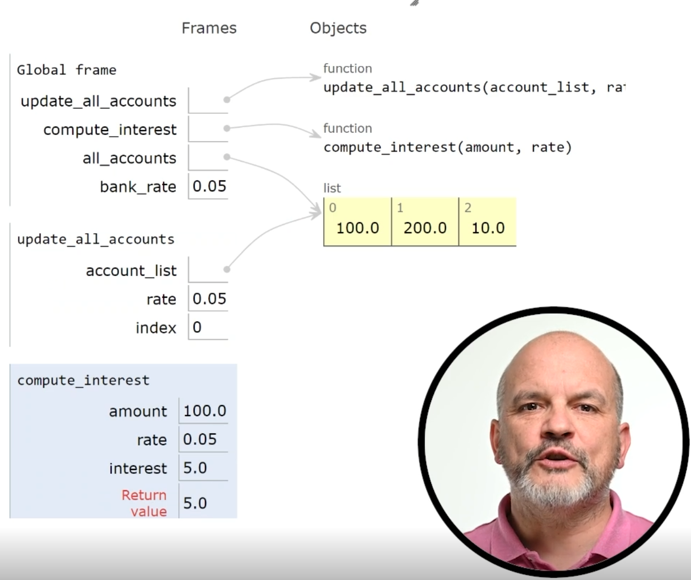

# Functions and Code Modularity

## Functions

def function_name(params1, params2):

### 1. Function name

Is how you call the function and is decided by you. In python should be the same style style e.g. snake case as variables.

Should also be descriptive of the function's use.

### 2. Parameter list

When you call the function you can provide arguments to parameters to get the function to do something unique. You can use these parameters as variables in your function

There can be 0 or more parameters

### 3. Function's body

All the code inside the function

### 4. Return value

In python returns are typed dynamically.

## Built in functions

input
str
min
max
type -> shows type
pow -> power of a^b^
abs -> absolute value

## return multiple values

can return multiple values by separating with commas

can use multiple assignment to eat up the multiple returns

some_function(string) -> num1 + num2
a + b = some_function('hi)

## Calling a function

function name + its arguments

if there is no arguments then you give it some empty brackets

```
hello("world") # world is an argument
hi()
```

## Positional arguments

When your function takes multiple arguments you can specify which argument goes to what param by the order you type them in.

There is another type but man just ignores it.

## How it works

1. When a function is called it pauses the current execution and starts executing the function code.
2. After the function code is complete it resumes the original execution. No asynchronisity unless the language supports it.
3. The return value then replaces where that function call was placed.

## Care

- Make sure you call the right amount of aruments
- The right types

# Stack Frame

Data structure that stores information about function call. Created when function is invoked. Destroyed at end of function.

- Parameters
- Local variables
- Return address

Called stack frame because each one is organised into a stack. 

**Last in first out** type data structure
- Most recent stack frame is on top of the stack so is the first to be removed.

- Stack frames ensure that each function has own set of local variables that can't be accessed outside of that.

## Example important



**Global Frame**: Top level stack frame. It comes across function definitions and variable declarations and creates function objects within it to refer to those.

During a function call a new frame is created and the variables defined within it are separated into this frame.

Frames are discarded after the function code has returned.

## Importance

- Stack frames allow each function  to access their own variables and parameters
- Allow functions to call functions

# 3.6.2 Functions Code Tracing

```python
def add_discount(sum, percentage):
  return sum * (1 - percentage)
        
def add_taxes(sum, percentage):
  return sum * (1 + percentage)
         
products = 23.5 + 12.2 + 4.75
total = add_taxes(add_discount(products, 0.05), 0.13)
print("The total sum is", total)
```

Functions: add_discount, add_taxes
variables: products, total
Parameters: sum, percentage

## state diagram

products -> 40.45
add_discount(products, 0.05) -> 38.4275
add_taxes(38.4275, 0.13) -> 43.422075

# Modularisation

Improves...
- Readability and understanding of code.
- Reusability and maintainability
- Manages complexity
- Cohesion/ abstraction
- testing
- scalability
- Can avoid duplication

## Semantically coherent

- Easier to undetstand/maintain

### Example

- Math module contains functions and mathematical constants.
- This module doesn't have the ability to draw shapes
- Module does what it says and nothing more.

### Separation of concerns

A function shouldn't take input, process and return.
It should manage one of those tasks.

## Positional and Keyword arguments

Named arguments look like this.

```python
parameter_name = argument_value
```

- Choosing a keyword that doesn't exist raises an error.

## Default functional values

When defining a function we can write the parameter like this

```python
parameter_name = default_value
```
- Default values allow us to ignore certain arguments.
- Default parameters have to be defined after the regular ones.
- Also positional parameters must come before keyword parameters

## Variable scope

- Determined where declared
- Global and local scopes
- Global scope means can be accessed anywhere
- Local scope only works within that scope.

To use global variables ou have to specify global version

```python
x = 0

def my_func():
  global x # important line or else you get an error
  x += 1
  print(x) -> 1

print(x) -> 1

  # global keyword important as it allows us to modify a global.
  # Without global keyword it gets treated like a local variable.
n = 5
def square(n):
  result = n * n
  print(n)
  return result

print(square(2))

# output 2 4
```

You can't use global variable when you **assign it in the function**. It becomes local and you can't refer to the global one from inside the function.

## nonlocal

```python

def my_func():
  x = 12

  def inner():
    x = 10 # creates a new local x and doesn't affect the outer.
  inner()
  print(x)

my_func() # output = 12
```

## Example but with nonlocal keyword

- Similar to global except only for the enclosing scope opposed to variables declared in the global scope.

```python
# x = 15 : nonlocal keyword won't touch this
# globally declared example.

def my_func():
  x = 12

  def inner():
    nonlocal x
    x = 10 # tells python to rewrite the outer x
  inner()
  print(x)

my_func() # output = 10
```
## Overall...

It's just easier to avoid name conflicts or avoid using globals inside of functions.

> Python scopes are just really messy so I'm just not going to bother.

# LEGB rules: Order that python looks for variable names

Local
Enclosing
Global
Built in