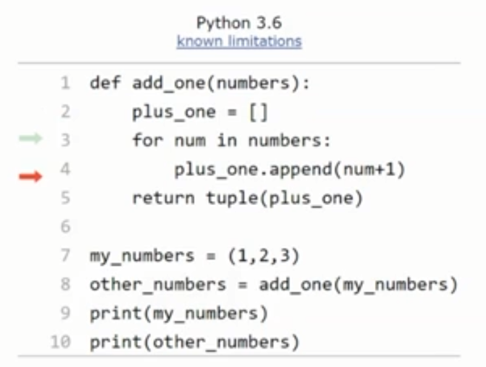
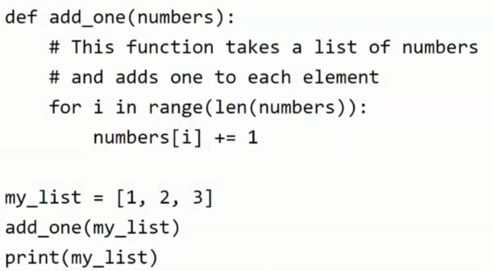

# Side Effects

Any changes to the state of the program made by a function. A function that writes to a file or modifies a global variable. They aren't necessarily bad but make it harder to test.

Pure functions don't do any of this and are easier to test and understand.

## Immutable objects

- strings are immutable.
- Tuples also unmutable.
`(1, 2, 3)`

Can use functions to stop changing globals. You can pass a global as an argument and a shallow copy is made for use in that function.

When passing reference to an immutable object to make 'changes' for instance you usually have to create your own version of it. For instance creating a list from a tuple.

## Unpure function

- As the list is passed by reference we can modify it from within a function. That means we can see the changes reflected outside the function and we don't have to really return it.
- Considered a side effect but is usually discouraged as requires care to execute.