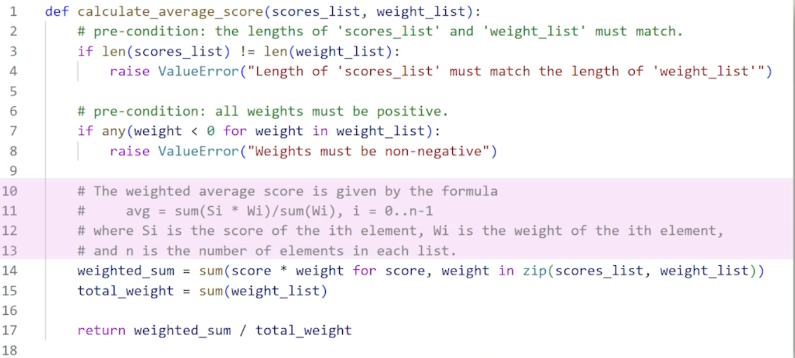

# Code documentation

Documentation helps others get to grip with your code.

```python
# comments are ignored by the compiler and allow you to decorate your code with useful information.

# Great for collaboration
```

## The other camp

- Code should be self documented. Like you write it in a way that doesn't require comments.

- Comments should focus on why instead of the what. Comments shouldn't just say what the code does.
- Should document edge cases.
- Use consistent formatting.
- provide context.
```
def multiply(number1, number2):
  return (number1 * number2)
```
You should assume the reader knows python and doesn't need every step explained.

## Good example of documentation



- Notice how it explains why the code is there and not stating exactly how it does it.

## Docstring

Special type of comment in python. Can be used to document interfaces, side effects etc.

There are guides made by google/numpy that allow you to standardise your docstrings.

Docstrings look like this..

"""
args:
  yad yad aya
"""

When you use help() function on a function it will allow you to access the docstring.