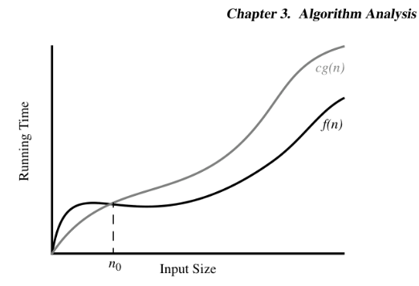

# 📈 Asymptotic Analysis and Big O Notation

In **asymptotic analysis**, we care about how fast an algorithm grows as the **input size (n)** gets large — instead of counting the exact number of operations.

We assume each step in our high-level code (like a variable assignment or a basic arithmetic operation) takes roughly the same amount of time: **O(1)**. So, we focus on loops and recursive calls — these are the main causes of inefficiency.

[📹 Helpful Video](https://www.youtube.com/watch?v=0oDAlMwTrLo)

---

## 📉 What’s an Asymptote?

An **asymptote** is a line that a function gets closer and closer to as `n` grows, but never quite touches. In algorithms, we care about the function’s **dominant term** — the one that grows fastest.

Example:

```
f(n) = n² + 2n + 6
```

* As `n` becomes very large, the `n²` term dominates.
* So we say: **f(n) is O(n²)**.
* We ignore `2n` and `6` because they’re small compared to `n²` for large input.


---

## 📊 Why Asymptotic Analysis Helps

Algorithms may seem fast at first, but their long-term behavior is what matters. Asymptotic analysis helps us **compare** how algorithms scale.

> It's not about how fast you start — it's about how you finish.

---

# ⚙️ Big O Notation

## 💡 What is Big O?

Big O gives us an **upper bound** — a worst-case estimate of how slow an algorithm can be.

We write:

```
f(n) ≤ c · g(n)  for all n ≥ n₀
```

This means: *f(n) grows no faster than g(n), beyond some point n₀.*

So if:

```
f(n) = 3n⁹ + 9n³ + 12
```

We simplify this to:

```
f(n) is O(n⁹)
```

* Ignore constants (3, 9, 12)
* Ignore lower-order terms (n³, constant)
* Only the **highest-degree term** matters

> Technically, you could say `O(n¹⁰⁰)`, but that would be unhelpful. Always aim for the **tightest** Big O you can give.



Here, `c` is just a constant multiplier to keep `cg(n)` above `f(n)` from a certain point onwards (`n₀`).

---

## 🔎 How to Use Big O

* Focus on how the algorithm scales with input size
* Ignore constants and less significant terms
* Give the **simplest, most accurate bound**

---

# 📉 Big Omega (Ω)

**Big Ω** is the opposite of Big O — it gives a **lower bound**. It tells us how **efficient** an algorithm can be at best.

* Example: If an algorithm **must** look at all `n` items to work, it’s at least **Ω(n)**.

---

# ⚖️ Big Theta (Θ)

**Big Θ** gives a **tight bound** — when the **best-case and worst-case** running times grow at the same rate.

> You can say an algorithm is **Θ(f(n))** only if it is both:
>
> * **O(f(n))** (upper bound)
> * **Ω(f(n))** (lower bound)

So yes — you report **Big Theta** when Big O and Big Omega are the same.

---

# 🧠 Constant Time: O(1)

Some operations always take the same amount of time, no matter the size of the input.

Examples in Python:

```python
len(data)  # O(1)
data[5]    # O(1)
```

Accessing an array element is **O(1)** because memory is laid out contiguously — so we can compute the memory address with a formula:

```
memory_start + index = element_address
```

---

# 📊 Prefix Averages

This is where you build a new array where each element is the **average so far** of all previous elements.

* Useful for rolling averages, like analyzing year-on-year returns.
* Sounds more practical than it initially seems 😅

---

# 🧪 Proving Algorithm Correctness

## ✋ Counterexamples

* To **disprove** a claim like "all elements have X", you only need **one** counterexample.
* To **prove** a claim like "at least one element has X", you just show that one example.

## 🔁 Contrapositive

If someone claims: “If a·b is even, then a or b must be even.”

Instead of proving that directly, prove the contrapositive:

> “If **both** a and b are odd, then a·b is odd.”

If the contrapositive is true, the original statement is true too.

## ❌ Contradiction

Assume a statement is false, then show that leads to a contradiction.

* If that contradiction exists, the original statement must be true.

> ⚠️ These sections could still use some tightening up. Just marking them here.

---

# 🔄 Induction & Loop Invariants

## 🔗 Induction

> Placeholder — you mentioned this needs work. Let me know if you'd like help writing out a proof by induction example.

## ♻️ Loop Invariants

> Also needs elaboration — typically used to prove loops do what we think they do. Want help fleshing this out?

---

Let me know if you want this turned into a polished Markdown doc or GitHub README format. Or if you'd like visual labels to go with your diagrams!
