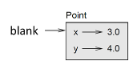
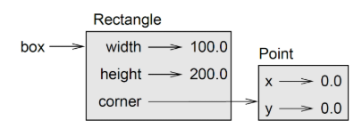
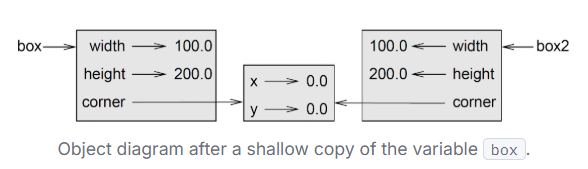
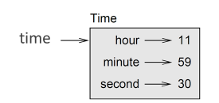

# Implementing Classes in Python

## Principles of OOP
### Data Encapsulation

Let's you bundle related data and methods together. It's a little different to just hiding data.

A universe without OOP and data encapsulation you'd have pokemon written like this

pikachu_attack = 12
pikachu_health = 100

These are only related to me because the variable names have meaning to me. A computer will have no clue these are related so I would have to pair them up manually each time.

Now turn back on OOP

pikachu.attack = 12
pikachu.health = 100

Here attack and health are attributes of the pokemon object called pikachu. They are bundled together onto the same object and can be easily passed down together to a function.

```
def damage(pokemon):
  print(f'{pokemon.health * pokemon.attack} damage!')
```

Any methods defined on pikachu will be linked to pikachu's internal stats.

Another aspect of encapsulating is controlling how the data is accessed/modified.

## Information hiding

- Important aspect of OOP.
- Allows you to protect integrity of certain attributes. For example you can block someone from accidentally turning pikachu's attack from 12 -> 'spaghetti' which could cause a lot of knock on issues during execution.

# Classes and Objects

Attributes are the **state** of the object. Methods are the **behaviour**

Instance variables belong to objects and class variables belong to the class.

## User Defined Types

Classes are a built in type and also are objects.

```py
class Point:
  """Doc string goes here. Typically would go 'represents a point in 2-d space'"""

print(Point)
<class '__main__.Point'>
```

Here Point is defined at top level so belongs to __main__.

## Creating instances

- Call it like a function and store it to a variable.

```py
origin = Point(x, y)
```

## Printing instances

When you print out an instance you get what class it belongs to and it's memory address stored in hexadecimal.

```py
print(origin)
# output: <__main__.Point object at 0x000002CF1E0EEAD0>
```

## Object diagrams



- Above diagram shows that blank variable is of type Point and point and has 2 attributes x and y.

Accessing `origin.x` tells the compiler to go to the object being referenced by origin and getting the value of it's attribute x.

> point.py has some relevant code.

- You can place attributes inside attributes

```py
box = Rectangle()
box.coordinate.x = 12
box.coordinate.y = 15
```
- Here we're asking the compiler to access the object referenced by box, get the coordinate attribute and then grab the x and y attribute from coordinate.



- Objects that are an attribute of another object are said to be **embedded**.

## Instances as return values

```py
def find_centre(box): 
    p = Point() 
    p.x = box.corner.x + box.width/2.0 
    p.y = box.corner.y + box.height/2.0 
    return p 
```

- Objects are mutable

## Copy module

- Let's you duplicate an object.
```py
import copy

object2 = copy.copy(object1)
```
- Copy means both objects have the same data but they're independent and point to different memory addresses allowing you to modify them independently.

### is operator

- is operator can be used to check if you're referencing the same object.
```py
object1 is object2
# output: False

object1 == object2
# output: False
```

== checks that we're looking at the same object instead of equivalent objects.
- Checks object identity instead of the values being the same.

### Warning

When calling copy you also copy any underlying references stored on an object.

So in our previous example where the rectangle had an embedded point object, when we copied it over both rectangles would point to the same point. This means changing it in one object would change it in the.



**shallow copy** is the word for the above. Where we don't copy over any embedded objects but just the reference to that same object get's copied over.

`copy.deepcopy(object)`

Above comes to the rescue as it makes a deep copy where embedded objects also get copied fully.

## Debugging

When trying to access an attribute that doesn't exist you get **AtributeError**

`hasatr(object_name, 'string of attribute')`

- Above lets you check for attribute's existance. Returns a boolean.

# Classes and Functions

```py
class Time:
  """Represents time of day. Attributes: hour, minute, second"""
  def __init(self,hour, minute, second):
    self.hour = hour
    self.minute = minute
    self.second = second

time = Time(11, 59, 30)
```


```py
def print_time(time):
  print(f"{time.hour:02}:{time.minute:02}:{time.second:02}")
  # 02 formating makes it look more clocklike. So there are always 2 digits.
def is_after(time1, time2):
  """Checks if time1 takes place after time2 chronologically"""

  for attr in ["hour", "minute", "second"]:
        t1 = getattr(time1, attr)
        t2 = getattr(time2, attr)
        # getattr gets the attribute from time
        if t1 != t2:
            return t1 > t2
    return False

```

# Prototype and patch

- Where you write a very simple function to solve a problem and gradually fix the issues/errors.

- One problem with above is that it can generate code that is unnecessarily complex also you may never know if you have cleaned out enough bugs yet.

## Planned development

An alternative where you use high level insight to make development easier.

# Classes and Methods

## Object Oriented Features

Pyton is object oriented as it has the features required for OOP.

> I am kinda blitzing through this section. Probably a great place for catch up revision.

### __str__ method

defined inside a class and returns a string representation of an object.

this is what gets returned when you print an object. It is up to you how that gets formatted to a string.

Has some use during debugging.

## Operator overlaoding

### overloading +

```py
# defined in class
def __add__(self, other):
  ---
  ---

# the + symbol next to time object secretly runs this __add__ method.
print time + 12
```

- Changing behaviour of operators behind the scene is called operator overloading

### overloading ==

__eq__

similar as before. overloads ==

```py
class MyClass:
    def __init__(self, value):
        self.value = value

    def __eq__(self, other):
        if not isinstance(other, MyClass):
            return False
        return self.value == other.value 
```

## isinstance

built in function that takes a value and a class and returns True if value is an instance of class.

### __radd__

stands for right add side.

Used for when your object is on the right side of an addition operation.

# Polymorphism

Where different classes can make objectst that work in different functions.

Functions that work with multiple types are called polymorphic. This let's you reuse code in some cases.

## Debugging

It is good practice to keep objects of the same type to have similar interface. So any attributes defined on one object should also be present on another of the same type.

This can be solved using __init__