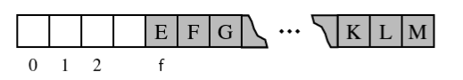
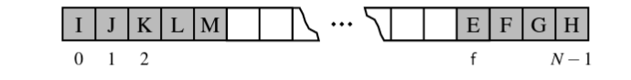

# 4.4.2 Reading: stacks, queues and deques

## Implementing stacks in python

Can emulate this using lists with the append method and the pop method. **However** there is all this extra functionality such as being able to get elements from the middle which we might want to get rid of.

In this case we need the **adapter pattern**

### Adapter pattern

Where we take an existing class and modify it so it matches a different class/interface.

We can do that by defining a new class that secretly has the class we want to modify. That way we can control it's behaviour from the class wrapped around that instance.

```py
class ArrayStack:
  def __init__(self):
    self.array = []

  def push(self, value):
    self.array.append(value)

  def pop(self):
    return self.array.pop()
  
  def top(self):
    return self.array[-1]
```

top, is_empty, len work in O(1) however when the internal array under the hood of that list needs resizing it can be O(n)

Amortization causes O(1) as the internal array has extra space we can gradually fill up. It is when all this extra capacity goes that we have to copy over all that data to a new array and it's efficiency goes to O(n).

When we know the max size we can perhaps give that as an argument. It is more efficient to fill up that already reserved space than it is to keep filling up an empty array over time.

### Using stacks to reverse data

If we plop 1, 2, 3 into a stack, it will come back out as 3, 2, 1 provided we pop all of themout. This is thanks to that LIFO trait.

### Matching opening and closers (delimiters)

Earlier in another section i touched on how stacks can be used to match opening and closing brackets in code editors for instance. This can also apply to HTML tags.

The function works by parsing through a sequence of delimiters and whenever you come across an opening delimiter you put it on the stack and whenever you come across a closing delimiter you compare it against the stack and if they match then you pop it off and keep going. If you reac the end and the stack is empty then **WOOHOO**. Otherise you're missing a closing delimiter.

Considering there are n number of push callas and n pop calls it runs in O(n) time even if a lot of the steps are O(1)

## Queues

In python can emulate this by creating our own class that works on a list.

When programming it be careful of popping that first element as it always causes the wrost case scenario where every element needs to shuffle its way forward. 

It always causes the worst case scenario where Θ(n).

To avoid this tragedy we can replace the earliest non-None index with None and store an explicit variable which tracks where our 'first' index is. This keeps dequeueing at O(1)



The first few cells have been replaced by none

This is bad for when a list might have been in use for a long period of time as that front part keeps growing.

### Using an array circularly

We have an underlying array of fixed length that is longer than the number of elements in the queue.



> Note the book explains this kind of poorly. Worth reading up on harder.

From [youtube](https://www.youtube.com/watch?v=VFSUWEAFmy4) the main idea is you keep track of front and end of queue and when you run out of space on the back you wrap around the front.

## Dequeus

Can be implemented with circular array