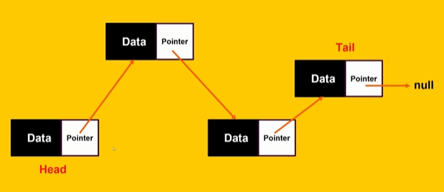
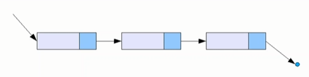
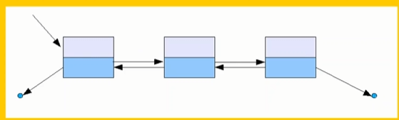
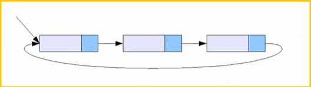
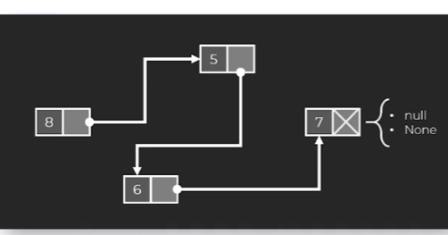
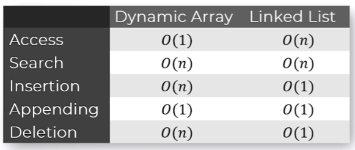

# Linked Lists

- More flexible and dont store data contiguously
- Great as they have dynamic memory allocation. Adding/removing elements is very flexible.
- Great for situations where number of elements change frequently

## Structure

They're made up of nodes which contain data and a pointer to the next node.

List ends when the pointer points to null

## Linked list operations

Insertion: Inserting anywhere is easy as you don't need to shift everything around.

Deletion: Deletion is simple by just changing pointers but requires traversing the list to find the node you wish to delete.

Traversal: Requires hopping from node to node.

Overall: More flexible but less fast.

## Singly linked lists

They make it easy to go forward but tricky to go back. Only 1 pointer going forward.

## Doubly linked lists

Pointers point both ways making it a little easier to navigate forwards and backwards

More complex to manage and use up more memory

## Circularly linked list

Can be singularly or doubly linked but the end pointer goes back to the beginning

## Advantages to linked lists
- Dynamic size.
- Efficient insertions/deletions. No need to shift everything.
- Flexibility. No contiguous memory required

## Diadvantages
- Can't index and we have to traverse the linked list.
- Requires more memory as you're holding a pointer per node or maybe 2
- Can get quite complex to code especially doubly and circularly.

# 4.5.2 Linked list integration

2 ways to implement lists. Dynamic arrays and linked lists.

Regular arrays: store data contiguously and are fixed size. They let you quickly get data from them because of that contiguousness. Bit of math involving adding the index to the memory address of that first element.

---

Regular arrays can be used to implement lists. We keep an internal array and keep track of the reference to the tail. Whenever adding an element we plop it into the reference of the tail and update the tail to the new position.

Whenever the tail tries to access an element outside of that internal array you get an error as you're trying to access a pointer that doesn't exist.

This means that our list is capped off at the size of the array. A rather simple and problemed solution is to just declare a very large internal array. The problem with this is that it is a memory hog. Especially if you don't get close to filling up that giant array.

Dynamic array (different to linked lists) have a leg up over arrays as they only use up the space required and not much more. When that internal array gets filled up, we typically create a whole new array double the original size and copy over all the elements.

That keeps going on and saves us from just allocating a lot of memory straight away.

## Problem

If we take out an element we have to shuffle down all the elements afterwards and then update the pointer at the end of the list.

This means removing the last element is very efficient as we're just taking out the element and moving that pointer.

Removing that first element creates the worst possible scenario where everything shuffles down. Same with insertion at the beginning where we have to shuffle all the elements to the right to make space.

## Solution/linked lists

Elements in list are not stored contiguously. They are made up of nodes that contain a piece of data and a reference to the next element in the list.

To navigate this list we have to go through the preceding elements. Navigatin this list is therefore quite resource intensive.

Last element stores null/None as pointer. We need to store pointers to front and end of the list.

As we are storing the reference to each node we are using up more memory.

## List functions

Append: We stick another node to end of list. This is done by changing that final None pointer to a pointer to the next node.

Removing the first element is very efficient. We just update the head pointer to the second element. Adding an element to the beginning is efficient as well as we just have our new node point to the head node and update the head pointer to point to that new first node.

## Problem

Removing the last element is less efficient using linked lists however. We have to navigate down the whole list to find that last element making sure to keep track of the second last element as we need to update that with a None pointer and have the tail pointer refernce that.

> Inefficiency comes from accessing penultimate element from the list.

We can use a doubly linked list to help solve this problem at the expense of higher memory usage. This lets us go forwards and backwards.

This is because the tail now has a reference to the predecessor and we can just start from the back. Only takes 3 steps.

## Comparison

### Access

In dynamic arrays it is more efficient to access elements as we can add the index to the memory address to get whatever element we need. This is fixed in terms of resource use.

Linked lists are less efficient as to access an element further down you need to first navigate the list and in the worst case you're looking at O(n) to get that last element.

However they are decent for accessing that first and last element.

### Search

Both equal at O(n). Switching to a linked list holds no benefit when your primary use for that data structure is search. This is because you will have to navigate through each one in the worst case to find your element(unless that array is sorted then you can binary search)

### Insertion

Dynamic array in general is O(1) however when that array fills up you get an O(n) problem.

With linked list you typically use it to insert/delete from the front and insert from the back O(1). If you were to use that linked list inappropriately however and insert in the middle (near) the end you do get O(n).

Implementation in [python](/algorithms/week4/python_/linkedadt.py)