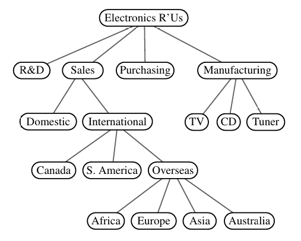
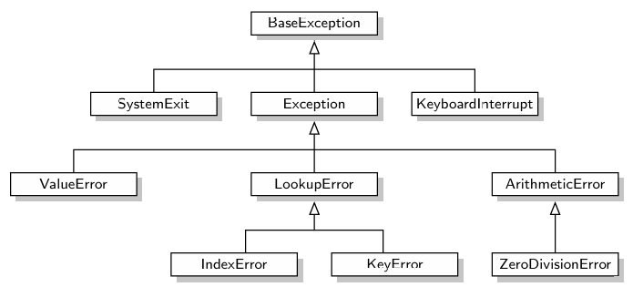
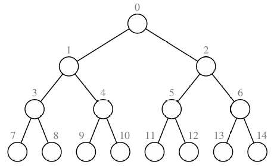
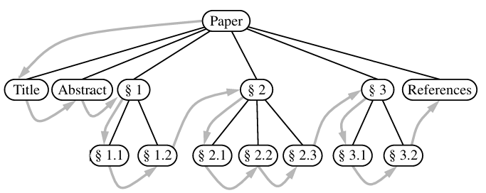
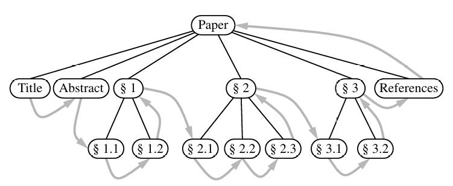

# Trees!

## Non-Linear data

By nonlinear instead of just describing data as before or after we can describe them as adjacent or branching. Overall just **richer** than linear data types.

Trees also naturally represent data for certain structures. Such as how a website is organised down to its pages, GUIs, databases and file systems.

- They store data **hierarchically** instead of linearly.
- Language used to describe node relationships are **parent/child** and **descendent/ancestor**.
- Aside from the **root** node, all nodes have parents and 0 or more children.

- Trees can be empty where they have no nodes.
- Nodes that have the same parent node are **siblings**
- **Internal** nodes have children and **external** nodes do not.
- Extenal nodes are sometimes called **leaves**.

- Subtrees are located within trees. To describe a subtree you'd describe it's root. 'Subtree rooted at directory A'
- **Edges** of a tree are the relationship between a parent and child. Contains 2 nodes that are directly related.
- **Paths** are made of edges. Think of edges like roads and paths like the collection of roads that make routes.
- **height** of a node is the number of edges between the route and it. Or how many edges in the path from that element to the route.

## Tree representation

- Nodes represented by rectangles or ovals.
- Edges represented by the lines between these nodes.

## Tree formal definition

A set of nodes holding elements that are stored with parent child relationships.

- For a nonempty tree there is a special node called the root of T which has no parent.
- Each node (that isn't the root) of the tree only has 1 parent.

## Ancestor definition

A node can be an ancestor of itself and anything above it is an ancestor.

We can reverse this to define a descendant. So if node A is ancestor of node B then node B is node A's descendant.

## Edges and Paths

An edge is a pair of nodes that have a direct parent child relationship. A path is made up **completely** of interconnected edges. No jumps allowed.

> The book uses some goofy ah example using recursive definitions I found difficult to think about.

## General Tree example

Python class inheritance forms a tree



Above image shows just the branch with all the exception types. The BaseException class is what everything and all the user defined exceptions are built off of.

## Ordered Trees
A tree is ordered if the children of the nodes are in a meaningful order. This requires the children can be identified to be in a particular order.

An example is a family tree where sibling nodes are organised based on age.

This is normally visualised by placing the elements left to right.

      |root|
    /    |     \
   /     |      \
|child1||child2||child3|

In a binary tree where each node has 2 children, they would be stored as either **left** or **right**.

## Tree abstract data type

For python we could do with an abstract tree type so we can use inheritance to make more concrete types. There are a few concrete methods we will keep on the abstract trees as well as a few abstract methods that will need to be changed when we make our concrete types. Such as Binary Trees.

We're using **positions** to **abstract** away nodes. An element is stored per position and the positions satisfy parent-child relationship.

This position object has 1 method and is typically stored in tree adt.

> **'p'** is the position object and **'T'** is the tree object.

`p.element()`
- Returns element stored.

The tree ADT has the following **accessor methods** in order to navigate the tree.

```py
T.root()
# Returns position for root of T
# or non if tree is empty
T.is_root(p)
# Takes a position and return True if
# it is the root of T.
T.parent(p)
# Returns position of parent of p
T.num_children(p)
# Returns the number of children of position P
T.children(p)
# Creates an iterable for the children of p.
T.is_leaf(p)
# Returns true if p has no children
len(T)
# Return the number of positions within T
T.is_empty(p)
T.positions(p)
# Generates iterable for all positions
iter(T)
# Generates iterable for all elements stored in the tree.
```
- For the above if an incorrect position is given as an argument it generates a ValueError.
- If the tree is ordered then T.children(p) gives the children in correct order.
- These are just accessor methods.
- Some are concrete in that they are the final method and others are still abstract and **need** to be replaced by the class inheriting it.

## Keeping a Tree Abstract Base Class

```py
class Tree:
    class Position:
        def element(self):
            # returns the element of this position
        def __eq__(self, other):
            # If other points to the same position then we return True
        def __ne__(self, other):
            # inverse of above.
    #------[end of position class]------

    # These methods below must be implemented
    # by any subclass. In this base class each one
    # should raise an error if not implemented.

    # e.g. raiseNotImplementedError(
    # 'must be implemented')

    def root(self):
        # Returns position of root.
        # None if empty

    def parent(self, p)
        # Returns position of parent of
        # given position
    
    def num_children(self, p):
        # Returns number of children of
        # position p

    def children(self, p)
        # Returns iterable containing all
        # child positions of p
    def __len__(self):
        # Returns the number of elements in 
        # the tree

    # ---[Concreete methods implemented here]---
    def is_root(self, p)
        # True if the position represents the root.
        return self.root() == p
    def is_leaf(self, p)
        # True if the position has no children.
        return p.num_children == 0
    def is_empty(self)
        # True if the tree is empty.
        return len(self) == 0
```
> Notice how the last 3 methods have actual code. Because they can be written concretely in this class and not later redefined by any inheriting classes
## 8.1.3 Computing Depth and Height

Depth refers to the number of ancestors excluding the position in question. (As positions are their own ancestors but in this case we ignore)

T has a depth of 0

### Depth defined

- If position p is the root then it has a depth of 0.
- The child of a position has +1 the depth of its parent.

We can use both parts of the definition to create amethod

```py
def depth(self, p):
    if self.is_root(p)
        return 0
    else:
        return 1 + self.depth(self.parent(p))
        # Recursive loop keeps asking if parent
        # is the root and adds 1 each time
```
Has time complexity of O(n). This is because in the worst case all the elements are aligned linearly and we have to run through each position to find the root.

However it is more descriptive to state running time in terms of d~p~ which denoteas depth of the position in the tree. This is because the depth can be a lot smaller than the number of elements in the tree.

O(d~p~ + 1) -> They don't really explain where that + 1 comes from but I'm not upset.

### Height defined
The root holds the greatest height in a tree.

1) If position p is a leaf then the height of p is 0.

2) Otherwise the height of p is one more than it's children's max height.

The height of a tree is the height of the root and is also equal to the maximum depth of its leaves.

Height and depth are like the opposite of each other. So the root of the tree has the least depth but the greatest height. 

> They cover a lot of ways of figuring out a height of a node and it all seems to be recursively done where every node needs investigating.
# Binary Tree
- **Ordered** tree where each parent has no more than **2** children.
- Children are sorted left and right. A left child has precedence over a right child.
- If these children are subtrees then we call them left and right subtree of that node.
- In **proper** (full) binary trees, each node **only** has 0 or 2 children. A tree where a node has 1 element is called an improper tree.

## Recursive binary tree definition

Binary tree can be empty

If not then it has a...
- Root node that stores an element.
- Left and Right subtree. (Either or can be empty)

## Python ADT

Binary tree builds upon tree class and had 3 more accessor methods.

t.left -> gives the left child position
t.right -> gives the right child position
t.sibling -> gives the sibling position or None if non-existant.

## BinaryTree Abstract Base Class Python

To implement in Python we inherit that Tree class defined earlier.

The BinaryTree class defined **remains abstract** as it do not include implementation for how the tree is held internally nor how certain behaviours of methods work.

It also overwrites some existing methods to be concrete. Such as **sibling** method.

### Notes on BinaryTree implementation
> They have written a full binary tree class but they leave some methods as just notes and not the full implmenetation.
- left and right method which returns a position
- sibling returns sibling or None if non-existant.
- children method is filled in and returns an iterable containing left and right position.

## Properties of binary trees


We can see that as we add levels to binary tree the max number of nodes grows exponentially. Could potentially do some cool maths with it.

For **proper** binary trees...
External == Internal + 1

## Reading 8.3: Implementing Trees

So far things have been kept abstract with no detailed implementations written yet. Thas all boutta change!

### **Linked structure** for Binary Tree
Section creates a concrete LinkedBinaryTree class that inherits from the binary tree class.

- Node class remains **private** '_Node' and is wrapped by a **public position** class.
- This node references the **element** stored as well as **children** and **parent**.
- If it has no parent (it is the root) then it stores None at the parent field.
- If a left or right child is missing then it stores None on them too.

### LBT (LinkedBinaryTree)

LBT constructor creates an empty internal tree. So far we only have accessor methods so there is no way to **modify** the tree.

These setter methods get created in the concrete LBT class.

e in these examples refers to elements.

```py
T.add_root(e):
# Create root for empty tree and stores the given element.
# Returns error if tree isn't empty.

T.add_left(p, e):
T.add_right(p, e):
# Takes a position and an element. Creates a new node and links it as the left/right child of p with element e.

T.replace(p, e):
# Replaces the element at a given position and returns the previously stored element.

T.delete(p):
# Deletes the path and moves the child up to fill its place.
# If there are multiple children then it throws an error.
# Returns the element that was in the deleted position.
T.attach(p, T1, T2)
# p must be a leaf and lets you attach trees left and right. 
```
> Each of the above operations are O(1) at worse case.

### Array based implementation

Could number the positions on T.



> There are benefits for going each way. I was too tired to look at the speed of each operation

# Tree Traversal Algorithms

## Preorder and postorder traversals of general trees

Both run in O(n)

### Preorder
In preorder traversal, the root is first visited and then subtrees rooted at its children are traversed recursively.

If the tree is ordered then the subtrees are visited in the order of the children.



### Postorder

Recursively traverses the subtrees of the children of the root first before reaching the rot.



## Breadth First Tree Traversal

Where we look at all the positions at a particular depth before we look at the next depth. Popular for chess AI.

Isn't recursive as we aren't looking at the complete depth of subtrees. We're skimming over them before going to the next depth level.

We use **queue** to enable FIFO semantics when we visit nodes. O(n) as there are n calls to enqueue and n calls to dequeue.

## Inorder Traversal of a Binary Tree


