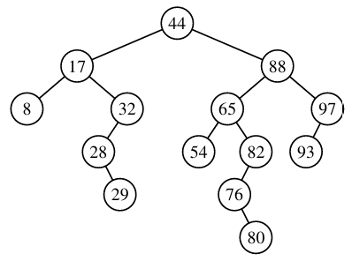
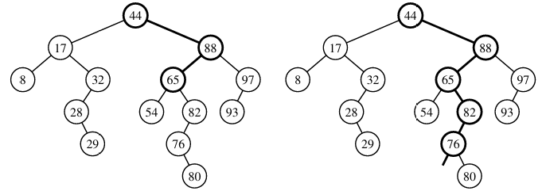
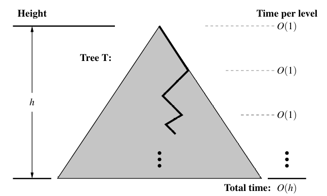
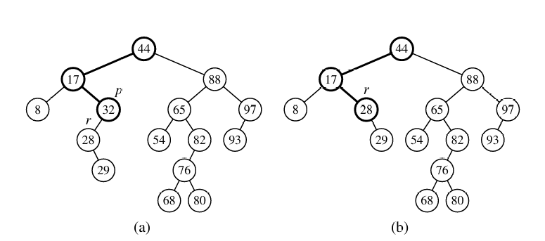
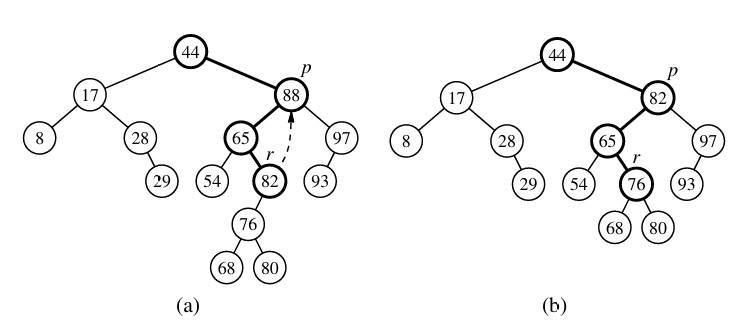

# Binary Search Trees Reading

| Feature              | **Binary Tree (e.g. BST)**                  | **Array (sorted)**              |
| -------------------- | ------------------------------------------- | ------------------------------- |
| **Search time**      | `O(log n)` (balanced BST)                   | `O(log n)` (binary search)      |
| **Insertion time**   | `O(log n)` (balanced), `O(n)` if unbalanced | `O(n)` (have to shift elements) |
| **Deletion time**    | `O(log n)` (balanced)                       | `O(n)` (shift elements)         |
| **Memory usage**     | **Higher** (pointers, nodes)                | **Lower** (contiguous block)    |
| **Structure**        | Dynamic (can grow/shrink)                   | Static or semi-dynamic          |
| **Access by index**  | `O(n)` (in-order traversal)                 | **`O(1)`** random access        |
| **Maintains order?** | Yes (in-order traversal)                    | Yes (sorted array)              |

There's great benefit when it comes to inserting and deleting elements for BSTs over Arrays as you do not have to shift over elements. The tradeoff for this is that trees do use more memory than a corresponding array.

> Section 11.1 Data Structures and Algorithms in python Michael T Goodrich

This section we're using a **search tree** to implement a **sorted map** M.

M[K]: Returns value V associated with key K. If it doesn't exist then raise a KeyError.

`__getitem__()`

M[K] = V: Associate value V with key K.

`__setitem__()`

del M[K]: Remove key value pair of K and V. Raise KeyError if it doesn't exist.

`__delitem__()`

Also..

Reporting keys in sorted order, find_range(start, stop) and find_gt(k)

## Binary Trees are perfect for storing map data assuming keys haev order relation


>Example of BST with integer keys. This omits the values

- Position p has a key k, is greater than the keys stored in the left subtree, but less than the keys stored in the right subtree.
- We're talking about the key and not the value.

## Navigating BST - Inorder traversal

O(n) where we navigate the tree from left to right.

Search trees have a few more methods

```
first() -> Least key position
last() -> Greatest key position
before(p) -> Returns key position 1 before
after(p) -> Returns key position 1 after
```

First can be programmed by repeated left steps until you're at a leaf. Last can be achieved by repeated right steps until you're at a leaf.

## Searches 11.1.2



> Successful search for 65 and an unsuccessful search of 68

As visible, a successful search just returns the corresponding position. An **unsuccessful** search returns the **last** position searched.



O(h) where h is the height. Not O(n) because the amount of elements in subtrees not explored do not affect the time to find a specific element.

### Importance of search algorithm for sorted map ADT

When trying to get/set/del an element the first step would be to search for it. Because these operations first start with a search they run in O(h) time as well.

## Insertion

M[k] = v

This is some syntactic sugar for the __setitem__ method.

1. First we have to search for this position in the tree.
2. If it is there we re-assign the value. If not we stick a node onto that last position of the failed search.

## Deletion

If deleted position has 1 child then the deletion is simple. The parent of p just references the deleted positions child.



When there are 2 children then we can't just slide the 2 subtrees up.

1. Locate position r which is the position before p. (greatest value which is still less than p)

2. We replace p's position with r and delete the original r.

> This works recursively until the deletion just deletion only has to shuffle one position up.



## 11.1.4 Python Implementation

I had a look and it was pretty cool. A whole load of detailed methods.

Generating an iteration is O(n) as we need to find every element but pretty much all operations have a worst case running time dependant on **height** of the BST.

We get the worst case when every element added increases the height. This occurs when elements get added in a continuously increasing/decreasing amount.

The above makes sense as you are constantly filling up the right/left side of the tree.

This is unlikely when the numbers are given completely randomly. On average the height would become log(n) so worst case is O(log n)

## 5.4.2

Had to skip this as the link wasn't working.

Worth coming back for study?

[beewoop](https://onlinestudy.york.ac.uk/courses/1637/pages/5-dot-4-2-activity-bst-visualisation?module_item_id=128970)