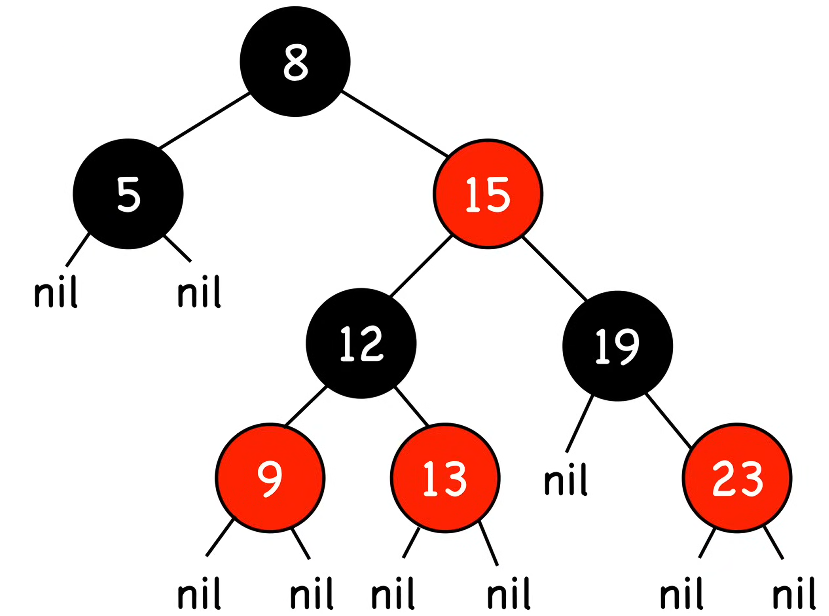
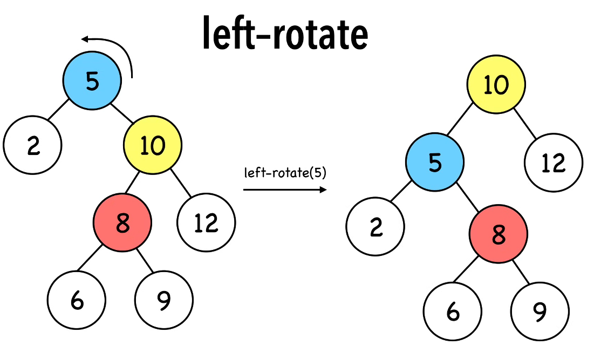
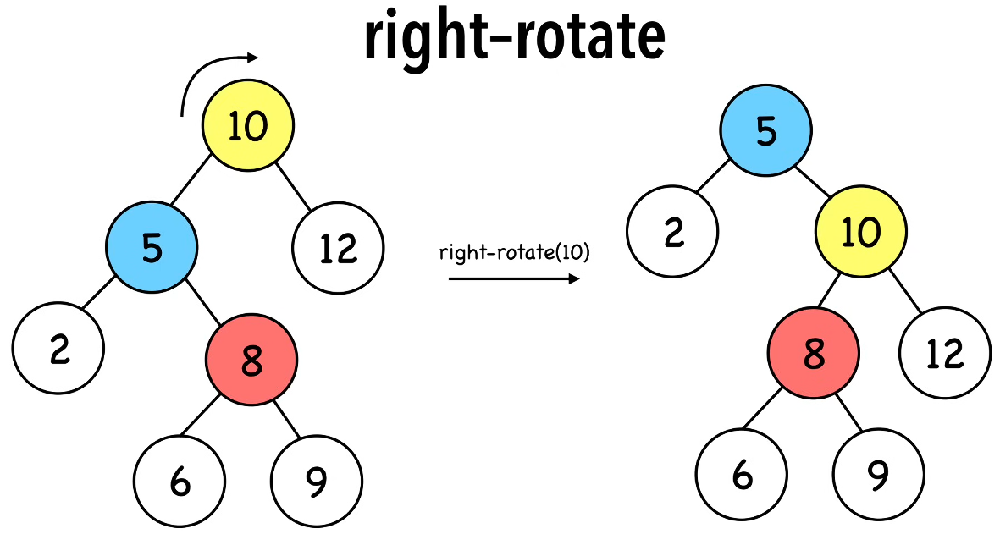

# Reading Red Black Trees

> 11.6 in the book

Binary search trees are just a sorted binary tree.

Red and black trees are self balancing binary search trees that ensure O(log n) time complexity for relevant operations. Their heights are guaranteed to be log n thanks to that self balancing nature.

Useful where performance is crucial such as with databases, file systems and memory management.

To remain balanced it uses O(1) structural changes. **AVL trees** and **(2, 4) trees**, which are alternatives, usually require more complex restructuring after certain operations.

## Rules

The nodes are coloured red and black according to following rules.

**Root property:** Black

**Red Property:** Children of red nodes are black

**Depth Property:** Nodes with zero or one children have the same **black depth**. Black depth means the number of black ancestors they have. Note a node is ancestor to itself.

- Top node (the root) is black.
- 10 which is a red node has black children.
- 3, 4, 6, 8, 11, 13, 14, 17 have zero or one children.
- As elements are ancestors to themselves, 3 and 4 have the same black depth of 3.
- All nodes listed above have a black depth of 2.
- We don't count the root when calculating **black height**

## Youtube Video Analysis

[Video Link](https://www.youtube.com/watch?v=qvZGUFHWChY)

1. Nodes are either red or black.
2. Root and leaves(nil nodes) are black.
3. Red nodes have black children. (No 2 reds in a row)
4. Nodes with 0 or 1 children have same black depth. All nil nodes back to the root have same black height. Black height is a property of the whole tree as it is the same across all paths.

As trees are recursive, all paths from a node to its nil descendants contain the same number of black nodes.

- In image assume the nils are black.

### Extra Notes

- Nodes need one storage bit ot keep track of colour.
- Route to farthest nil is no more than twice the length to the shortest nil.
- Shortest possible path has all black nodes and the longest possible path is alternating red and black.

## Operations

Searching: Done the exact same way as a Binary Search Tree. This means it is proportional to the height. O(h) or O(log n).

### Insertion

Insertion starts similar to a regular BST where we first need to perform a **search** for that position. When we reach a NIL we put a new leaf in that position.

If we're inserting the root (the tree was empty before) then we colour this leaf black. In all other cases where we're inserting an element it goes in **red**.

#### Fixing a double red

If you're sticking a red onto a red then you have a problem as the children of red are black.

To fix this issue we use **rotation**

##### Rotation

- Alters structure of tree by rearranging subtrees.
- Decreases height of the tree. Shorter subtrees get longer and longer subtrees get shorter.
- Order of elements not affected. Elements remain in order.
- O(1)

###### Left rotation

In above image red and black is turned off to make the rotation easier to follow.

We're doing a left rotation of the root which is the blue node 5

As visible 10 becomes 5s parent and 5 becomes 8s parent. The right subtree gets dragged up.

###### Right rotate

Essentially undoes that previous right rotation.

---

Now we're all bougee about rotation, back to insertion and solving that double red problem.

Overall strategy

1. Firstly insert that red node.
2. Now we recolor and rotate to make the tree happy.

Watch the [youtube](https://www.youtube.com/watch?v=5IBxA-bZZH8&t=12s) series for more details.