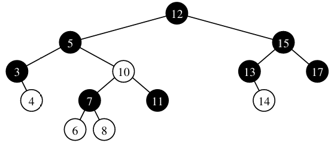

# Reading Red Black Trees

> 11.6 in the book

They are self balancing binary search trees that ensure O(log n) time complexity for relevant operations.

Useful where performance is crucial such as with databases, file systems and memory management.

To remain balanced it uses O(1) structural changes. **AVL trees** and **(2, 4) trees**, which are alternatives, usually require more complex restructuring after certain operations.

## Rules

The nodes are coloured red and black according to following rules.

**Root property:** Black

**Red Property:** Children of red nodes are black

**Depth Property:** Nodes with zero or one children have the same **black depth**. Black depth means the number of black ancestors they have. Note a node is ancestor to itself.

- Top node (the root) is black.
- 10 which is a red node has black children.
- 3, 4, 6, 8, 11, 13, 14, 17 have zero or one children.
- As elements are ancestors to themselves, 3 and 4 have the same black depth of 3.
- All nodes listed above have a black depth of 3.

## Operations

Searching: Done the exact same way as a Binary Search Tree. This means it is proportional to the height. O(h) or O(log n).

> I think O(log n) because the nodes don't just pile up in a line. They fan out so the height doesn't increase as fast as the elements contained does.

### Insertion

