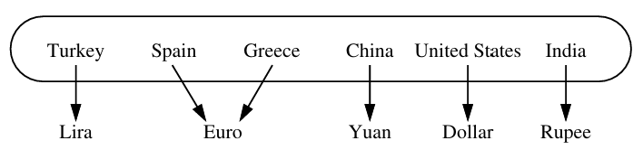

# Maps, Sets and Hash Tables

## 10.1 Maps and Dicts

Dict is a dictionary where keys are mapped to values.

The keys are unique although the values can be the same across multiple keys

In the above diagram spain and greece have the same value which is legal.

### Map ADT

Map and Dicts basically the same. If you've been programming for a while the behaviour is pretty average/what you expect.

#### Accessing Values

M[k]

#### Setting Values

M[k] = 'Hello world!!'

#### Deleting values

del M[k]

Deletes the whole key value pair.

#### Checking length

len(M)

Can check the number of keys.

#### Generate iterable

iter(M)

Returns an iterable containing all the keys of the map. You can obviously loop with this iterable.

---

There are a number of other methods but I don't think it's necessary to state here.

