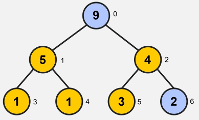

Absolutely — let’s fuse both sets of notes into one clear, rich, and well-structured set that covers everything from **heap fundamentals**, to **heap-based priority queues**, and **heap sort**, while preserving your examples and images.

---

# 📚 Heaps & Priority Queues

## 🧱 What Is a Heap?

A **heap** is a specialized binary tree that satisfies the **heap property**:

* In a **max-heap**, every parent node is **greater than or equal to** its children.
* In a **min-heap**, every parent node is **less than or equal to** its children.

This property ensures that the **maximum or minimum value is always at the root**, depending on the type of heap.

### ✅ Heap Structure

* Heaps are always **complete binary trees**:

  * All levels are **fully filled** except possibly the last.
  * The last level is filled **from left to right**.
* Height of the heap is `O(log n)`.
* They are typically implemented as **arrays**, not with pointer-based trees.

| Relationship | Formula        |
| ------------ | -------------- |
| Parent       | `(i - 1) // 2` |
| Left child   | `2i + 1`       |
| Right child  | `2i + 2`       |

---

## 🚦 Priority Queues & Heaps

A **priority queue** is like a queue, but each element is associated with a **priority (key)**.

* The element with the **highest priority** (in a max-heap) or **lowest priority** (in a min-heap) is **removed first**.
* This allows more nuanced scheduling than FIFO.

### 🎯 Priority Queue Operations

| Operation                       | Description                                         | Time (heap) |
| ------------------------------- | --------------------------------------------------- | ----------- |
| `insert(k, v)`                  | Add a key-value pair to the queue                   | `O(log n)`  |
| `min()` / `max()`               | Get the item with the highest priority (no removal) | `O(1)`      |
| `remove_min()` / `remove_max()` | Remove the item with the highest priority           | `O(log n)`  |

### 🔁 Priority Queue: Python Example

```python
import heapq

pq = []
heapq.heappush(pq, (5, 'task A'))
heapq.heappush(pq, (2, 'task B'))
heapq.heappush(pq, (7, 'task C'))

heapq.heappop(pq)  # (2, 'task B') → removed first due to lowest key
```

---

## ⚙️ Heap Operations

### 🆙 Insertion (`O(log n)`)

1. Insert the new element at the **end** of the heap (bottom row, far left).
2. **Bubble up** (upheap) to restore the heap property.

**Max-Heap Example**:

* Insert `16`, which is greater than its parent.
* Swap with each parent until correct position is found (or root is reached).


---

### 🔽 Deletion of Root (`O(log n)`)

1. Replace the **root** with the **last element** in the heap.
2. **Bubble down** (downheap) the new root:

   * Swap with the **greater child** (max-heap) or **smaller child** (min-heap) to restore the heap property.

> Continue until the heap property is restored.

---

## 🔁 Bottom-Up Heap Construction (`O(n)`)

When building a heap from an unsorted array, you can use **heapify**:

1. Start from the **last non-leaf node** and move upward.
2. Apply **heapification** (bubble down) at each step.

**Example**:

Unsorted array:

```
[3, 1, 4, 1, 5, 9, 2]
```

Visualized as a binary tree:


Steps:

* Start at index `2` (value = 4), compare with children → swap with `9`.
* Continue up: at index `1`, swap `1` with `5`.
* At index `0`, swap `3` with largest child `9`, then continue.


---

## 📦 Heap Sort

Once a **max-heap** is built, we can sort the array:

1. Swap the **root (max)** with the **last element**.
2. Reduce heap size by 1.
3. Heapify the root again.
4. Repeat until heap size = 1.




### 🕒 Time Complexity of Heap Sort

| Case    | Time         |
| ------- | ------------ |
| Best    | `O(n log n)` |
| Average | `O(n log n)` |
| Worst   | `O(n log n)` |

> Not the fastest sort (e.g., QuickSort is usually faster), but it's **in-place**, requires **no extra memory**, and has consistent performance.

---

## 📌 Min-Heap vs Max-Heap Summary

| Heap Type | Root     | Used In                              |
| --------- | -------- | ------------------------------------ |
| Min-Heap  | Smallest | Sorting (Heap Sort)                  |
| Max-Heap  | Largest  | Priority Queues (scheduling, queues) |

---

## ✅ Summary

* Heaps are **complete binary trees** optimized for quick access to min/max elements.
* They're widely used in **priority queues** and **heap sort**.
* Implementing heaps as arrays allows fast, cache-friendly performance.
* Bottom-up construction is faster than inserting one-by-one.
* The height is always `O(log n)`, ensuring fast insertions and deletions.

---

Would you like a quick Python class implementation of a binary heap or a visualizer tool recommendation next?
