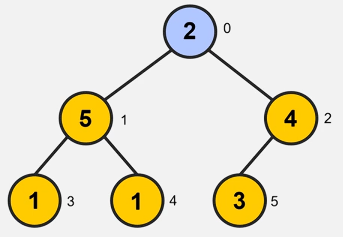

# Heap Sort

Heapification maintains heap property. Start from last non-leaf node and makes its way to the root.

## Example

Unsorted array

[3, 1, 4, 1, 5, 9, 2]

We're easily able to form that binary tree just off the structure of that array.

We start from the last non-leaf node which is 4 at index 2.

4 and its child 9 get swapped as 9 is the largest child. When we swap the largest child with the parent it is called **heapification**

We then move to the next non-leaf node which is 1 at index 1.

1 gets swapped with 5 at index 4 as it is the larger child.

The next non-leaf node is the root so we replace it with its largest child 9 at index 2.

We continue the bubbling down process by swapping 3 with 4.

The array is not quite sorted yet. We restart by replacing the root with the last element in the heap.

The last element gets swapped with the root which in this case is 9 at index 0 and 2 at index 6.

As 9 is in its correct position we ignore it from the sorting process.

We then heapify again until the algorithm is fully complete.

The heap gets smaller and smaller each loop. It ends when the heap is at length 1.

## Time complexty of heap sort.

Best, worst and average case are all the same. n log n

Not the fastest algorithm but it's consistency and low memory requirements give it a niche use.