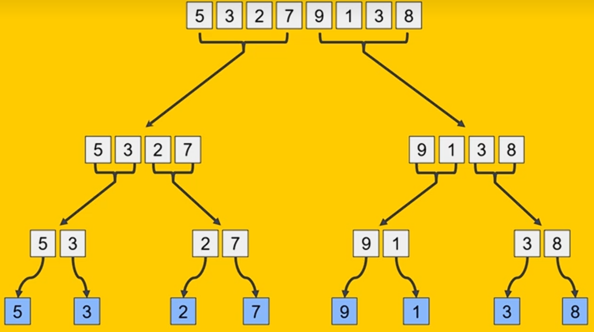
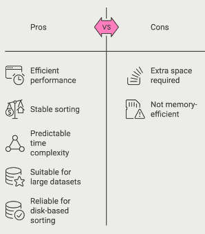

# Divide and Conquer Strategies for Sorting

Where you decompose problems into smaller, more manageable subproblems.

Very useful in applications such as database management, file compression and search engines.

## Merge Sort

Really efficient as it allows sorting in parallel.

Has guaranteed O(n logn) time complexity. Very efficient for large data sets.

### 3 steps

1. Divide step where the data is split into 2 equal halves.
2. Conquer: Each half is sorted recursively
3. Merge: Each sorted half is combined to form single fully sorted list.

At the bottom these sub arrays get merged in sorted order to form...

**[3, 5]**, [2, 7], **[1, 9]** and [3, 8]

> Arrays inbold got their order swapped to be in order.

This happens again so the sub-arrays of length 2 now get merged to sorted length 4 sub arrays

[2, 3, 5, 7] and [1, 3, 8, 9]

When combining sub arrays it is done by comparing the smallest value of each when deciding order.

[1, 2, 3, 3, 5, 8, 9]

## Time Complexity

Divide step. Number of operations to get it down to it's individual elements is log(n) as each division halfs number of elements. Performing the divide is O(1) as it is just simple index calculations.

Divide is overall O(logn)

Merge is O(n) because each element gets compared once. 

multiply these together to get O(nlogn)

## Practical applications

External applications where the dataset is too large to fit in memory.

## 6.3.2 Quick Sort

It's about choosing a pivot point and sorting the sub arrays created by that pivot. Then changing that pivot and sorting again.

### Pivot selection

1) First

2) Last

3) Randomly

4) Median

Choosing an appropriate pivot gets you performance gains. You're looking at trying to get even sub arrays.

Bad pivot is when you're consistently picking the smallest/largest element.

#### Example

We're using the last element of array as pivot point which is 5.

We're keeping 2 pointers that are scanning for elements smaller and larger than the pivot.

Left is looking for elements larger than the pivot and right is looking for elements smaller than the pivot. They travel from their direction.

left         right pivot
 ⬇️              ⬇️ ⬇️
 [3, 6, 2, 1, 4, 9, 5]

 Left moves down until it finds an element larger than the pivot which which in this case was 6 as it is larger than 5.

    left      right pivot
     ⬇️          ⬇️ ⬇️
 [3, 6, 2, 1, 4, 9, 5]

right then moves down until it finds an element smaller than th epivot which in this case is 4.

    left     right  pivot
     ⬇️       ⬇️    ⬇️
 [3, 6, 2, 1, 4, 9, 5]

Values on left and right get swapped so 6 and 4 trade positions.
 
    left     right  pivot
     ⬇️       ⬇️    ⬇️
 [3, 4, 2, 1, 6, 9, 5]

The pointers now resume what they were upto so traveling along the array.

The next element that is greater than the pivot in 4s path is 6 and the next element that is smaller than 5 for the right pointer is 1. Left and Right have already crossed so the pivot swaps places with left.

5 and 6 swap places.

    left     right  pivot
     ⬇️       ⬇️    ⬇️
 [3, 4, 2, 1, 5, 9, 6]

 This concludes the first iteration of quicksort as everything to the left is smaller than the pivot and everything to the right is larger than the pivot.

 - 3, 4, 2 and 1 are smaller than 5.

 - 9 and 6 are larger than 5

 - 5 is in the **correct** position so that leaves the sub-array to the left and right to be sorted recursively.

 ### Time Complexity

 O(nlogn)

 However when you choose a bad pivot that consistently produces unbalanced sub-arrays then you could see O(n^2^)

 ### Space Complexity

 O(log n)

 Because the sub-arrays get smaller on each step.

 Can also be O(n) when you choose a bad pivot where you're creating a sub-array of n-1 and 1 length.