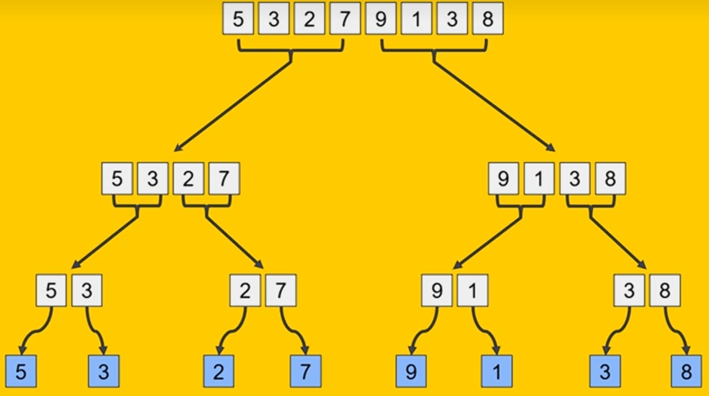
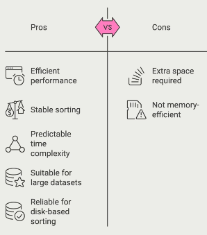

# Divide and Conquer Strategies for Sorting

Where you decompose problems into smaller, more manageable subproblems.

Very useful in applications such as database management, file compression and search engines.

## Merge Sort

Really efficient as it allows sorting in parallel.

Has guaranteed O(n logn) time complexity. Very efficient for large data sets.

### 3 steps

1. Divide step where the data is split into 2 equal halves.
2. Conquer: Each half is sorted recursively
3. Merge: Each sorted half is combined to form single fully sorted list.

At the bottom these sub arrays get merged in sorted order to form...

**[3, 5]**, [2, 7], **[1, 9]** and [3, 8]

> Arrays inbold got their order swapped to be in order.

This happens again so the sub-arrays of length 2 now get merged to sorted length 4 sub arrays

[2, 3, 5, 7] and [1, 3, 8, 9]

When combining sub arrays it is done by comparing the smallest value of each when deciding order.

[1, 2, 3, 3, 5, 8, 9]

## Time Complexity

Divide step. Number of operations to get it down to it's individual elements is log2(n) as each division halfs number of elements. Performing the divide is O(1) as it is just simple index calculations.

Divide is overall O(logn)

Merge is O(n) because each element gets compared once. 

multiply these together to get O(nlogn)

## Practical applications

External applications where the dataset is too large to fit in memory.

## 6.3.2 Quick Sort