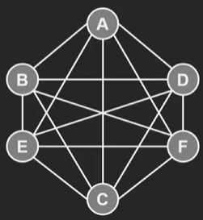
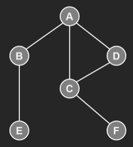
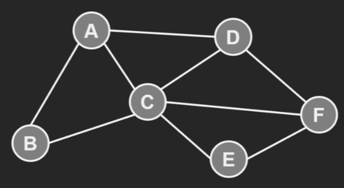
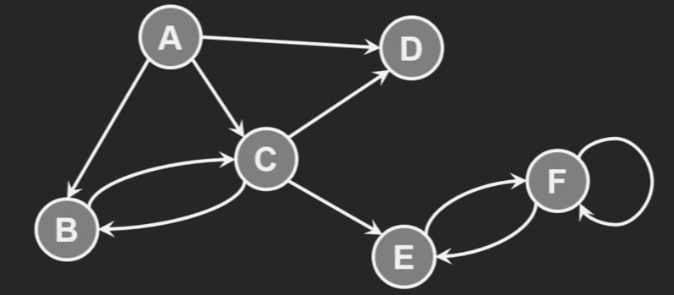
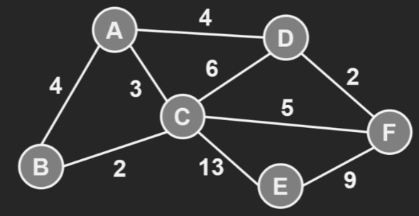
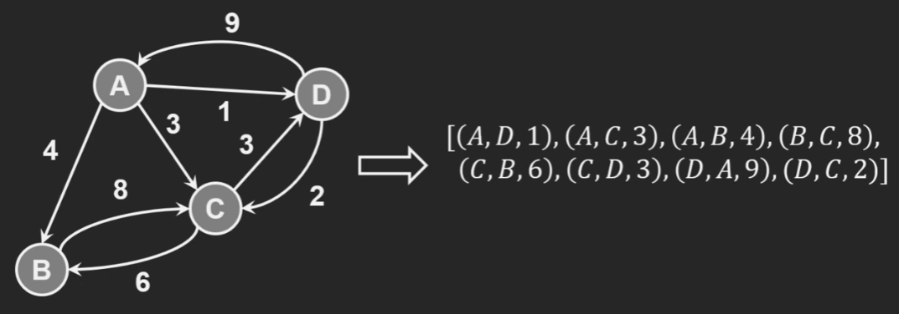
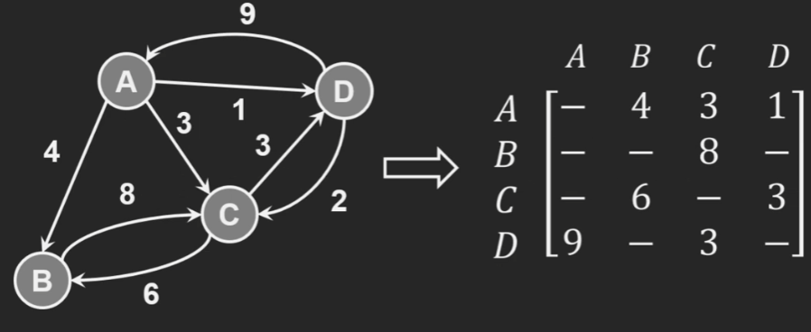
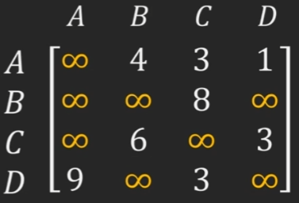
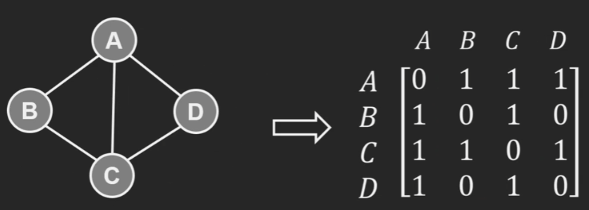
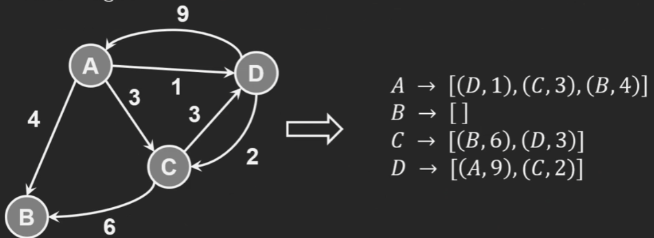

# Introduction

This week basically just covering graphs.


Graphs are consisted of vertices (nodes) connected by edges. They're one of the most flexible datatypes and can be used to model train networks, social networks etc.

**Nodes = Vertices**

Edges connect 2 vertices.
An empty graph is such that there are no edges or vertices

```
v = Ø
e = Ø

Ø Just means empty
```

A vertex can have **no** edges.


A real life example of this is where the vertices represent cities and the edges represent roades between them. A city on an island without these connections won't belong to an edge.

## Graph Density

A dense graph has close to **maximum number** of edges possible for a set amount of vertices.

A **complete grpah** has the maximum number of edges where you can navigate between vertex to any other vertex directly.



A sparse graph has very few edges relative to the number of vertices



## Graph Types

### Undirected Graph



- Social Media like facebook could represent friends like this.

### Directed Graph



- The edges have a direction
- Being able to get from one vertex to another doesn't mean the return trip is possible.
- Social media like twitter could represent followers like this

### Weighted graphs



- Each edge has a 'weight'.
- Weight can represent things like distance, cost and other arbitrary things.
- The weight of each edge could represent the time required to make a journey where the vertices represent places.
- Can be directed/undirected

`e.g. (u,v,w)`

- Above is a way of representing an edge where u is the source, v is the destination and w is the weight. Called a **triplet** because 3 values.
- Weights can also be **negative**.
- The trip from one node to another can have a different weight in reverse.

`e.g. (a,b,3) and (b,a,7)`

## Representing graphs on a computer

### Edge List

Where you store an array of edges in triplet notation



- Has strange structure. To find a particular edge you may have to navigate the whole list.
- Also some vertices may have no edges to represent them.

### Adjacency Matrix



- Rows represent source vertice and columns represent target
- When there are no edges between two vertices you can either represent with + or - infinite or 0. Important to match it to context.



- Positive infinity is used for minimisation problem and negative infinity used for maximisation problem.

#### Unweighted adjacency matrix



- No weights to put in the table so just 0s and 1s
- Symmetrical in an undirected graph

### Adjacency list



- Better: Only keep track of outgoing edges for each vertex.

## Pros and Cons

### Space

In terms of space, adjacency matrix performs poorly especially for sparse graphs as you're recording a whole table unnecesarily. A graph of 1000 vertices could need a million cells in the worst case where the graph is very sparse. Most of the cells are just holding wasted space.

This becomes less problematic with a more dense graph. If each vertex has a degree of 10 then you only need to store 5000 pairs of values.

Edge List and Adjacency List are really good for sparse graphs space wise. That being said when the graphs are dense then they are less efficient than an adjacency matrix space wise.

### Edge Weight Look up

Adjacency matrix let's you look up edge weight in constant time.

The other 2 requires you to traverse the list until you come across the edge of interest so they're less efficient. It can be O(E) where you have to traverse every single edge to get to the last one that has your weight of interest.

### Iterating All Edges

Edge List and Adjacency list is quite efficient at O(E) as you can just move down the list.

For adjacency Matrix it can be inefficient for a sparse graph as you're iterating through empty values. O(V^2^) as the number of edges is the number of vertices squared. For dense graphs it isn't so bad.