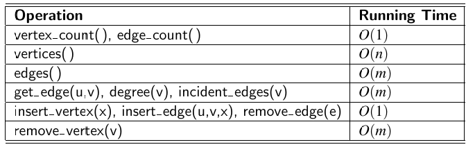

# 14.1 Graphs

In computer science when discussing graphs we're looking at connections between entities instead of the more traditional graphs. Histograms and bar charts etc are completely unrelated to the topic.

- Graph G
- Vertices V
- Edges E

Graphs are a set of vertices connected by edges. Some freaks say nodes and arcs.

Edges can be **directed** or **undirected**. In a directed graph `(u, v)` is going from vertex u to v. In an undirected graph `(v, u)` would refer to the same edge.

Mixed graphs exist where there are a mixture of directed and undirected edges.

You can convert all graph types into a digraph just by representing each undirected edge as 2 exdges going each way. `(u,v) and (v,u)`.

The **degree** of a vertex refers to the number of edges connecting it. This can be broken down to in-degree and out-degree showing the number of incoming and outgoing edges.

A **simple** graph contains no **parallel edges**. Parallel edge in an undirected graph has **multiple edges** between 2 vertices or in a directed graph has multiple edges between the same origin and destination.

**Simple** graphs also don't contain **self loops**. A self loop is an edge that goes and returns to the same vertex.

Simple graphs contain a **set** of edges. (Remember that set means no duplicates)

**Paths** are a set of vertices and edges so that you're able to navigate them without jumping or traveling an edge backwards. They start and stop on a vertex.

**Cycles** are paths that end at the same vertex. Note a singular vertex without edges doesn't count as a cycle as there needs to be 1 edge involved.

A **simple path** has each vertex in the path distinct. A **simple cycle** is the same except the original vertex is allowed to repeat at the end. (Obviously)

**Acyclic** means that a directed graph contains no cycles. That means once you leave a node there's no way back.

## Reachability

In a directed graph reachability between 2 vertices refers to is it possible to get from 1 vertex to another. We say u reaches v if there is a directed path from u to v. Reachability in this context may only be 1 way.

In an undirected graph reachability is 2 ways. So if u reaches v then v must also reach u. This is because you can just take the same path but backwards.

## Connected

A graph is connected if for any 2 set of vertices a path exists between them.

**strongly connected** digraph means that for any set of nodes you can make the trip. So going from u to v and v to u is possible.

## Subgraphs

Graphs inside of graphs, or a graph where the vertices and edges are a subset of the original graph.

A **spanning** subgraph contains all the vertices of the original graph but not necessarily all the edges.

---

# 14.1.1 Graph ADT (Abstract Data Type)

We need to make 3 classes, Vertex, Edge and Graph.

The vertex is the simplest class where the objects might just hold an arbitrary piece of data given by the user.

Edges also hold a piece of data given by the user and also have methods that let you find the endpoints of it. Finding both and the the corresponding endpoint methods should be defined.

> I'm tired. Go read the book.

---

# 14.2.1 Edge List Structure

Simplest but not the most efficient way to represent a graph. Involves storing the vertices in an unordered list and the egdes in another unordered list.

Vertex objects hold a reference to their own element as well as a reference to it's position in the list.

Edge objects also store an element and have references to the vertices associated with its endpoints.

They also astore a reference to their position in the list holding edges. This is to easily remove it from the list of edges.

## Performance of edge list structure

### Space complexity

Storing each edge/vertex uses O(1) space. That means the space required grows proportionally to the amount of edges and vertices.

O(n + m) (where n is vertices and m is edges)

### Running Time

Getting all edges/vertices takes O(n)/O(m) time. A search could also take that long as well.

Additions are really efficient as you can just add the vertex/edge to the list so it is O(1)

Removing a vertex means all the edges connected must go as well in which case a full search of the edge list must be done. This means deleting a vertex is O(m)

---

# 14.2.2 Adjacency List structure

Similar to edge list except we just store the edges associated with each vertex in their own **unordered linked list**.

We keep an **incident collection** which is just a list of edges incident to our particular vertex. For a directed graph outgoing and incoming edges can be stored in 2 separate lists.

## Performance of Adjacency List Structure

Reporting the degree of a vertex is better than the edge list because we have all connected edges already in a list so we can just iterate through those.

Edge list has to find all of them in a list containing all possible edges making it less efficient. We're comparing O(deg(v)) to O(m).

deg(v) = degree or our particular vertex.

For this reason deletions and searches are narrowed down by the degree of the vertex.

**space complexity** is still O(n+m)

---

# Adjacency Map Structure

