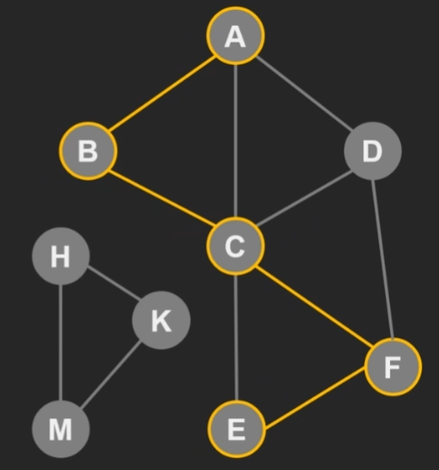
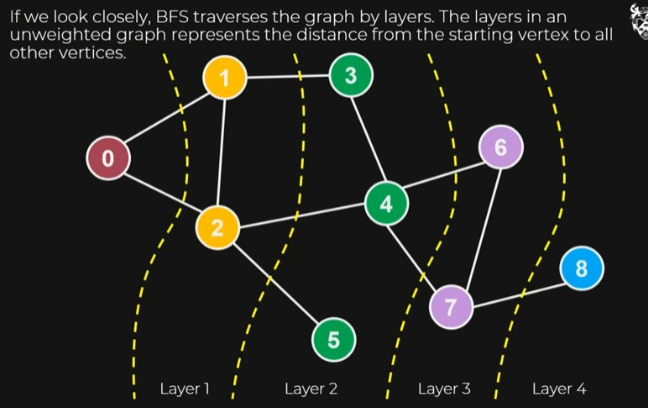

# Graph Traversal

2 main ways to explore every single edge and vertex of a graph. Depth First Search and Breadth First Search.

For simplicity we're just working with connected graphs so all nodes must be reachable to each other. An unconnected graph might have some isolated nodes with no edges or there could be a group of nodes not connected to the main body.

> Example of an unconnected graph

There is no path from A -> K so we say that they are disconnected and we have a disconnected graph.

## Depth First Search

The gist of it is we just go as far as we can and then back up when we can't go any further.

This algorithm is good for finding cycles in a graph.

### Recursive implementation

The algorithm can start at any vertex and with any edge.

We basically keep moving while prioritising moving to untouched vertices.

When we reach a state where there is no new vertex to go to we **backtrack** which is where we go to the previous node.

We then try and traverse any untouched connected vertices. If there is none then we can traverse to a vertex that isn't **processed**. Completed/processed means that all edges connected to a vertex have been traversed.

If all the vertices connected are compelete we back track again. Once we have explored every vertex and edge the algorithm is complete.

The **ending** involves getting back to the beginning.

The precise ordering doesn't matter for this algorithm.

#### Algorithm

The time complexity of the DFS is O(V+E) so it grows linearly with the amount of vertices and edges there are.

Backtracking can be implicitly done thanks to recursion.

**neighbours** method on each vertex is important and returns all outgoing vertices connected to the current vertex.

### Disconnected graphs

The algorithm would have to run for each separated segment of the graph.

### Iterative implementation

We can use **stack** datatype to approach DFS. The stack stores the discovered nodes and **not** the visited ones.

This emulates the call stack of the recursive implementation of the function.

1. Start with an arbitrary vertex and add all connected nodes to the stack.

2. As the original node has no more neighbours to explore we say it is processed. Processed elements are popped off.

This repeats until all vertices are processed.

Has same time complexity of the recursive version.

## Breadth first search

Uses queue (fifo).

1. Start with any node in the queue

2. First element in the queue gets all connected nodes added to the queue. Once it has no more unvisited edges we dequeue it.

3. Next element in the queue has same process done to it.

BFS traverses the graph in **layers**.

The order in which vertices are visited in a layer do not matter.

> The pseudocode for DFS and BFS is exactly the same except the data structure used to store values to be processed is different. In DFS we use stack and for BFS we use queue.

### Uses

It explores layers at a time so really good for finding shortest path and examining layers in a network.