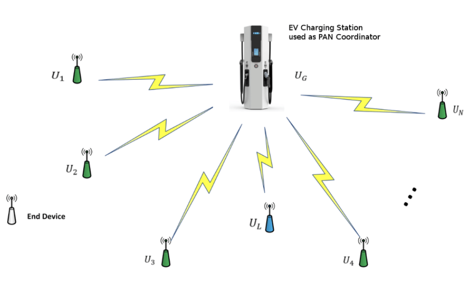

# Activity: Design a protocol

- Setting up the connection when new devices connect.

- Relaying an event: Device is charging something or stopped charging something.

- Device leaving the connection and needs to be disconnected.