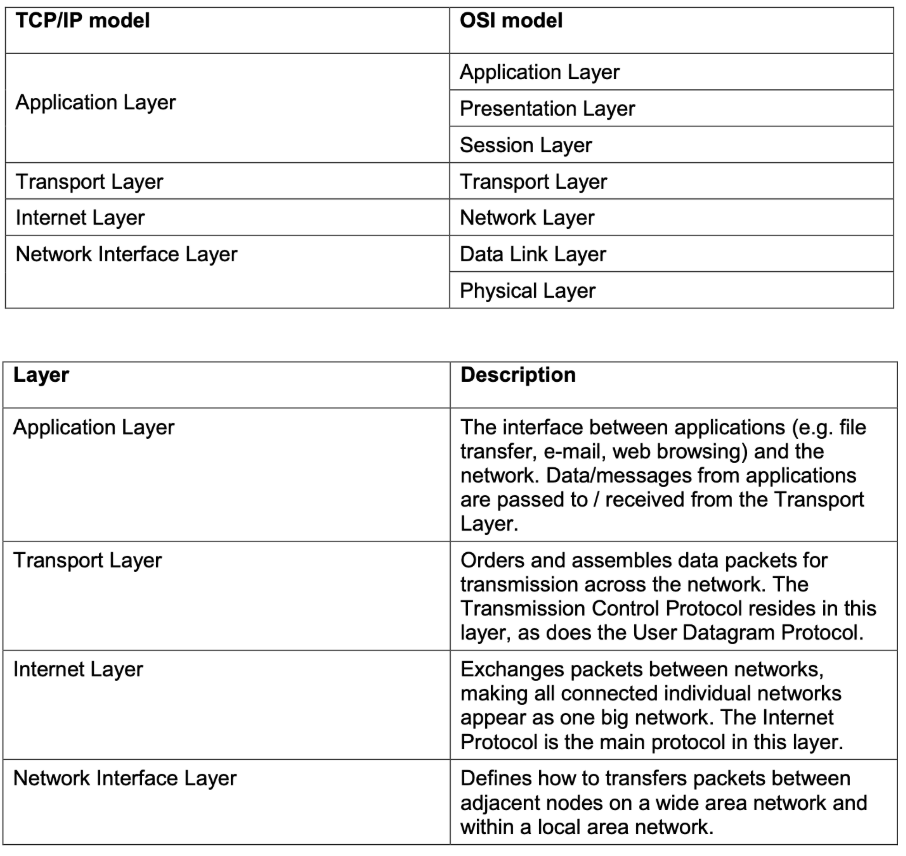

# 1.3.1: ISO/OSI and TCP/IP models

ISO/OSI defines 7 conceptual layers of a network. Each layer provides protocols for the layers above to work.

TCP model has just 4 layers and is actually used.

OSI is more used for educational/conceptual purposes whereas TCP/IP gets actual use in the real world.

# 1.3.2: Encapsulation

## User Data

Data which is generated by the user (duh). This includes things like files written in apps which may not have network access. For instance writing a word file in word.

It is more likely that this file is sent by an email client instead which does have network access.

### Sending user data across a network

It is very likely that this data gets split up into chunks wrapped by headers which gives network devices the necessary information to know where the information came from and where it's going. It also contains information concerning the type of file and which protocols it's following.

### Relating it back to TCP/IP

Header gets added each time the data passes a layer to another. These encapsulated chunks of data are known as packets and are what gets transmitted across a network.

As the packet reaches the recipient device each header gets stripped off as it passes back up the TCP/IP stack. As each header comes off the necessary information gets acted on.

# GPT Free style 🔥🔥🔥

# 🌐 1.3.1: ISO/OSI vs. TCP/IP Models

The **ISO/OSI (Open Systems Interconnection)** model defines a **7-layer framework** for how data moves through a network.

* Each layer provides services to the one above it and relies on the one below it.
* It’s **conceptual**: more of a teaching tool than a practical implementation.

The **TCP/IP model**, by contrast, has **4 layers** and is the **real-world standard** used on the Internet.

| OSI Model (7 layers) | TCP/IP Model (4 layers) |
| -------------------- | ----------------------- |
| Application          | Application             |
| Presentation         | Application             |
| Session              | Application             |
| Transport            | Transport               |
| Network              | Internet                |
| Data Link            | Network Access          |
| Physical             | Network Access          |

👉 **Key point**:

* **OSI** = theoretical framework, useful for understanding roles.
* **TCP/IP** = practical protocol suite actually running the Internet.
* TCP/IP merges OSI’s upper layers (App/Presentation/Session) and lower layers (Physical/Data Link).

---

# 📦 1.3.2: Encapsulation

Encapsulation is the process of **wrapping user data with protocol headers** (and sometimes trailers) as it moves *down* the networking stack.

---

## User Data

* Data generated by the **application** (e.g., text in a Word file).
* On its own, this data isn’t "network-ready".
* To be transmitted, it must be **handled by applications with network access** (e.g., sending that Word file as an email attachment).

---

## Sending User Data Across a Network

When transmitting:

1. Data gets split into **smaller chunks**.
2. Each chunk is **wrapped in headers** that describe:

   * Source & destination addresses.
   * Protocol information (TCP vs. UDP, file type, etc.).
   * Ordering and error-checking details.
3. These chunks are called **packets (generic)**, but depending on the layer they can also be called:

   * **Segments** (Transport layer, TCP/UDP).
   * **Packets** (Internet layer).
   * **Frames** (Link layer, e.g., Ethernet).
   * **Bits** (Physical layer, electrical/optical signals).

---

## Relation to TCP/IP Stack

* **Encapsulation** = headers added as data moves *down* the layers:

  * Application data → wrapped by TCP → wrapped by IP → wrapped by Ethernet → transmitted as signals.
* **Decapsulation** = headers removed as data moves *up* the stack on the receiving device.
* Each header is "acted upon" by its corresponding layer:

  * Transport header ensures reliability.
  * Internet header ensures correct addressing.
  * Network Access header ensures delivery over the physical medium.

👉 This "wrapping and unwrapping" process is what allows data to traverse across wildly different hardware and networks but still make sense to the receiving application.

---

# ✨ Key Takeaways

* **OSI vs TCP/IP**: OSI = theory (7 layers), TCP/IP = practice (4 layers).
* **Encapsulation**: ensures data is transmitted in a structured, reliable, and interoperable way.
* Without encapsulation, the network would have no context: packets would be meaningless gibberish.

---

🔥 Extra exam tip: Be ready to explain **why encapsulation is like postal mail** —

* User writes a letter (data).
* Envelope has address & postage (headers).
* Post office sorts/delivers based on this info (network layers).
* Receiver removes envelope to read the original content (decapsulation).