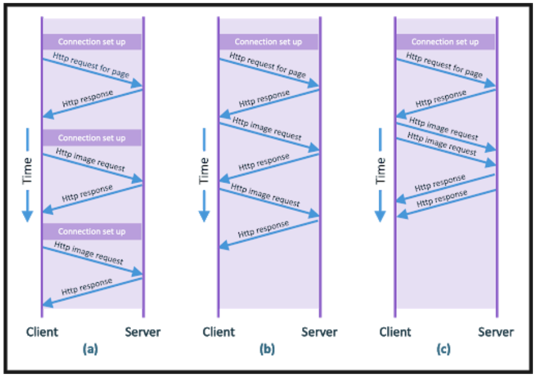

# HyperText Transer Protocol (HTTP)

Servers hold web pages as files which web browsers can make requests for over HTTP.

The request response for HTTP runs on TCP (transport layer) and is used for sending web pages around.

## URLs

Universal resource locations

Each page sits on a server as a file and in a particular directory structure on the server. That server identifies itself with a domain name.

Using the domain name, directory structure and file names gives a way of identifying each page with a unique identifier.

The identifier + protocol used to access the location are called the URL.

URLs can be used with different protocols other than HTTP. For example HTTPs is HTTP but with security (s).

FTP file transfer protocol

RTSP for streaming media.

## Hyper text

The user can type in a url or click on a hyperlink that contains a user allowing you to jump from page to page.

## HTTP communications

HTTP 1.0: Where when you send a request, you get a response back. This response should hopefully contain the requested resources in the body of the response.

HTTP as a stateless protocol. This is because no state is stored per communication and each communication is independent of each other.

HTTP 1.1: Lets you have a persistent conection which can save you time as you don't have to keep setting up the connection over and over again. For example if a web page has multiple images this can be sent over the same connection as that initial page whereas with HTTP 1.0 a separate http request would be setup per image.

Pipeline requests allow requests to be sent in a burst

> a shows http 1.0, b shows http 1.1, c shows burst