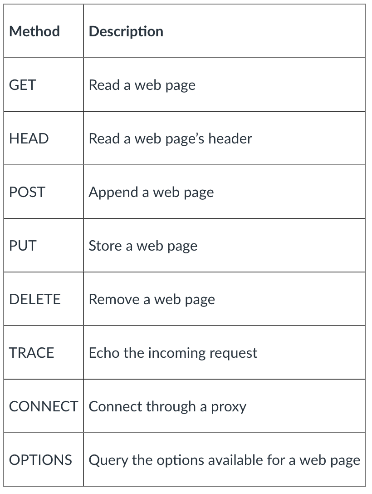

# HTTP request and response messages

HTTP is designed in an object oriented way so has multiple methods.

## Web and HTTP

Web page consist base html file with references to several objects such as jpegs, audio files etc.

Each object is addressable by url including that web page.

## HTTP Overview

Hypertext transfer protocol. It utilises the client server model where the client is a browser that requests and receives web objects which it then displays.

The server thends these objects as a response to requests.

HTTP is stateless meaning that no data is stored for past client requests.

Maintaining state within a protocol is complex as if an error occurs that causes the cilent and server to store different state then that would need reconciling.

### TCP

Client initiates TCP connection to server port 80. The server then accepts the TCP connection from client.

HTTP messsages get exchanged between browser and on the client and the web server.

Afterwards the TCP connection closes.

Non-persistent HTTP is where 1 object is sent over the TCP connection before closing.

To get multiple objects this way would require multiple connections.

Using persistent HTTP means multiple objects can be sent over that single TCP connection.

### RTT

RTT is the time for a small packet to travel to the server and back from the client.

HTTP response time is multiple RTT because it takes one RTT to initiate the TCP connection, another for the HTTP request and the first few bytes of the HTTP response to return.

Also the file transmission time.

That means 2RTT + file transmission time.

### HTTP response message

The response may or may not contain the page requested as that page may not exist or the server might not be able to handle that request at that time.

In this case the browser may receive a code indicating the problem.

The HTTP response message contains a header which gets sent to the receiver.

