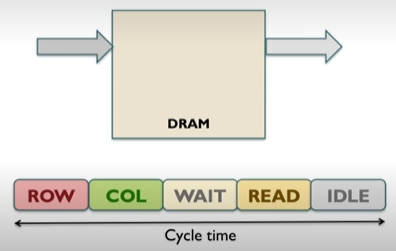
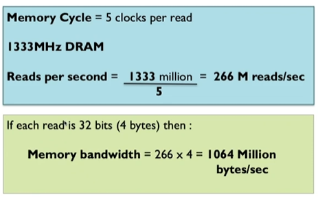
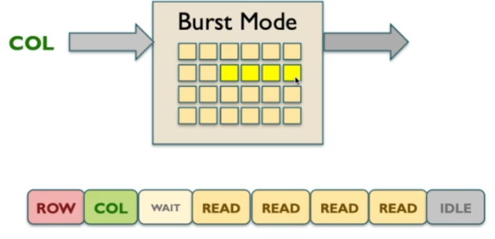
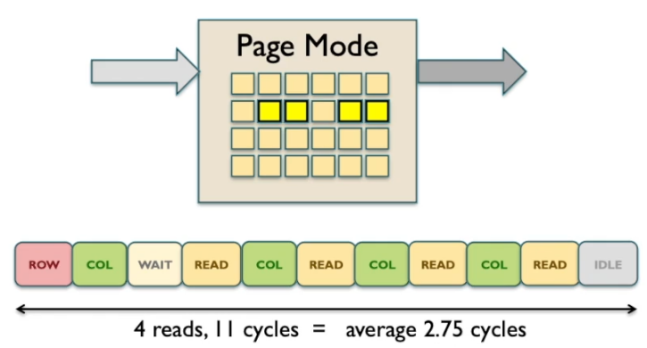

# Memory Timing Concepts

A row is half of an address.

CPU supplies a row to the DRAM.

First a row is read by the dram and then the cpu sends a collumn from the same address line which gives us the complete address.

DRAM requries a certain amount of time so now the dram waits so it can perform the read operation.

DRam can then locate the particular item in memory and output the piece of information.

Access time is the amount of time it takes for the DRAM to access and read when given the corresponding address.

The DRAM may require a recovery cycle where the DRAM does nothing.

All these together gets you the time read time.

Each one takes a cycle.




Cycle time dictates how many cycles you can do a second.

memory cycle = clocks per read.

So 5 clocks per read and 1333MHz DRAMa gets you 266M reads/sec

1333 million / 5 = 266 M reads/sec



# Boosting Memory Performance

## Burst Mode



4 read cycles and 4 other cycles. that meansd its 2 cycles per read which is more efficient than previous 5 cycles per read.

## Page mode



Instead of calling for the next row we can call for columns in that same row before idling.

# 📍 Locality in Computer Systems

**Locality** refers to the tendency of programs to access a relatively small portion of their address space at any given time.
It’s a **key principle** behind the design of caches, prefetching mechanisms, and memory hierarchies.

---

### 🔹 1. Temporal Locality (Locality in Time)

* **Definition:**
  If a data item (memory address) is accessed, it is likely to be accessed **again soon**.

* **Why it happens:**

  * Loops repeatedly access the same variables or instructions.
  * Recently used instructions or data remain relevant for short periods of time.

* **Example:**

  ```python
  sum = 0
  for i in range(100):
      sum += arr[i]
  ```

  * Variable `sum` is accessed on **every iteration**.
  * Loop instructions themselves are fetched repeatedly.

* **Optimization Strategies:**

  * **Caching** frequently used data and instructions.
  * **Register allocation** to keep hot variables close to the CPU.

---

### 🔹 2. Spatial Locality (Locality in Space)

* **Definition:**
  If a memory location is accessed, nearby memory locations are **likely** to be accessed soon.

* **Why it happens:**

  * Programs often store related data together (arrays, structs).
  * Sequential instruction execution fetches consecutive memory locations.

* **Example:**

  ```python
  for i in range(100):
      print(arr[i])
  ```

  * Accessing `arr[0]` is soon followed by `arr[1]`, `arr[2]`, etc.
  * CPU can prefetch these into cache lines.

* **Optimization Strategies:**

  * **Prefetching** contiguous memory blocks.
  * **Data structure alignment** for better memory access patterns.
  * **Burst mode DRAM access** to pull in sequential data efficiently.

---

### 💡 Why Locality Matters

* **Cache Efficiency:**
  Caches rely on locality to predict which data to keep close to the CPU.
* **Memory Hierarchy Design:**
  Locality principles dictate block sizes, cache replacement policies, and prefetching logic.
* **Performance Gains:**
  Exploiting locality reduces cache misses → fewer expensive main memory accesses.
