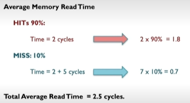
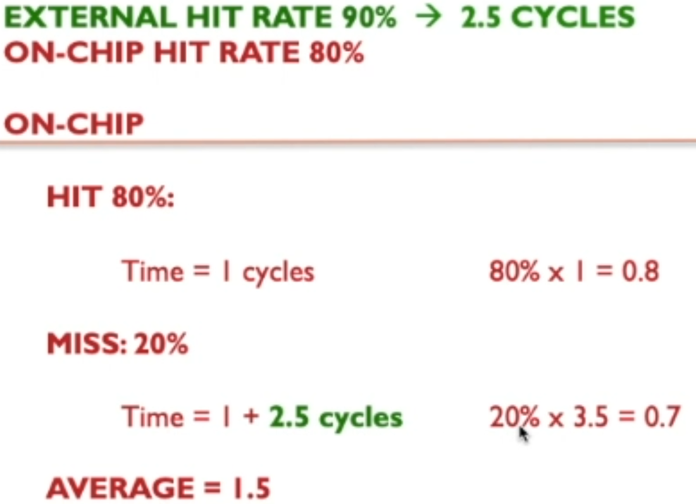
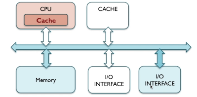

# Cache

## **Multilevel Cache Architectures – Balancing Speed and Efficiency**

* **Concept**:
  Modern CPUs use **multiple levels of cache** (L1, L2, L3) to reduce the gap between the speed of the processor and the main memory (DRAM).

  * **L1 Cache**:

    * Closest to the CPU cores
    * Very small (tens of KB)
    * Extremely fast, but expensive per byte
  * **L2 Cache**:

    * Larger (hundreds of KB to a few MB)
    * Slightly slower than L1 but still much faster than main memory
  * **L3 Cache**:

    * Shared across cores (tens of MB)
    * Larger and slower than L2, but reduces trips to main memory

* **Balancing Act**:

  * The CPU first looks in L1, then L2, then L3, before going to DRAM.
  * This **hierarchical design** allows frequent data to be accessed quickly (speed) while keeping costs and power usage lower (efficiency).
  * Without multiple cache levels, you’d either have:

    * A very small, fast but constantly missing cache → frequent slow memory access.
    * A huge fast cache → too expensive and power-hungry.

* **Impact**:

  * Improves **CPU utilisation** by keeping the processor from idling while waiting for data.
  * Supports **locality of reference** (both temporal and spatial).

---

## **Cache Management Policies – Importance for Performance**

* **Definition**:
  Cache management policies decide **what data goes into the cache, what stays, and what gets replaced** when the cache is full.

* **Key Policies**:

  1. **Replacement Policy**:

     * Common: LRU (Least Recently Used), FIFO (First In First Out), Random.
     * Impacts how well the cache retains useful data.
  2. **Write Policy**:

     * **Write-through**: Write to both cache and memory at the same time (safe but slower).
     * **Write-back**: Write to cache first, then memory later when needed (faster but more complex).
  3. **Allocation Policy**:

     * Decides whether to load data into the cache on a write miss.

* **Why Critical**:

  * Poor policies → frequent cache misses, meaning the CPU spends more time waiting for DRAM.
  * Good policies → maximise hit rate, keeping CPU pipelines fed with data.

* **Consequences of Poor Implementation**:

  * **Lower performance** due to high miss penalties.
  * **Pipeline stalls** leading to reduced instruction throughput.
  * Increased **memory bus contention**, worsening the von Neumann bottleneck.

## 2.3.2 Cache Memory Video

- Cache is faster ram but is a lot more expensive/fuel hungry than ram.

- Cache is used to keep things used very frequently.

Hit rate is how often something the CPU wants is in the cache. A low hit rate means the cpu needs to look in the comparatively slow memory more often.

A high hit rate means that the CPU doesn't have to look in the memory very often.

### Read time with cache

If it takes 5 cycles to read something from memory and just 2 form reading something from the cache then missing it in the cache means you took 7 cycles to find it.

Hit rate affects the average read time.

### Multilevel cache video

- Can have some cache integrated into cpu.

CPU when accessing the cache frees up buses for IO or other components to access the memory or external cache.