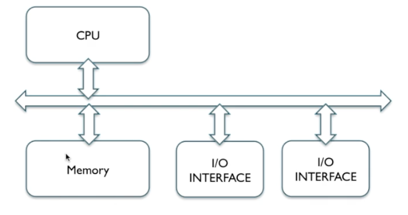
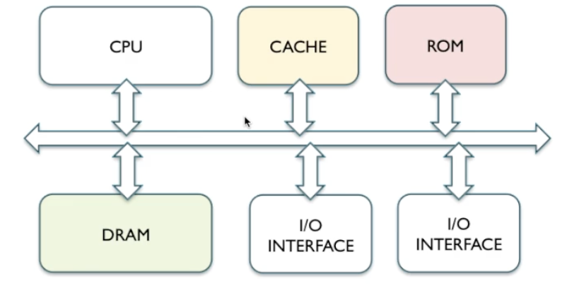
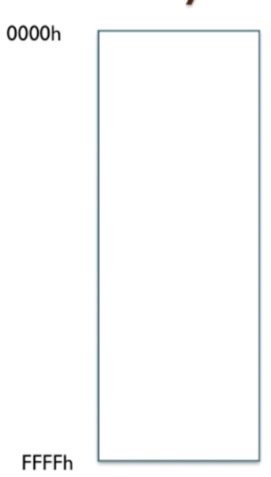
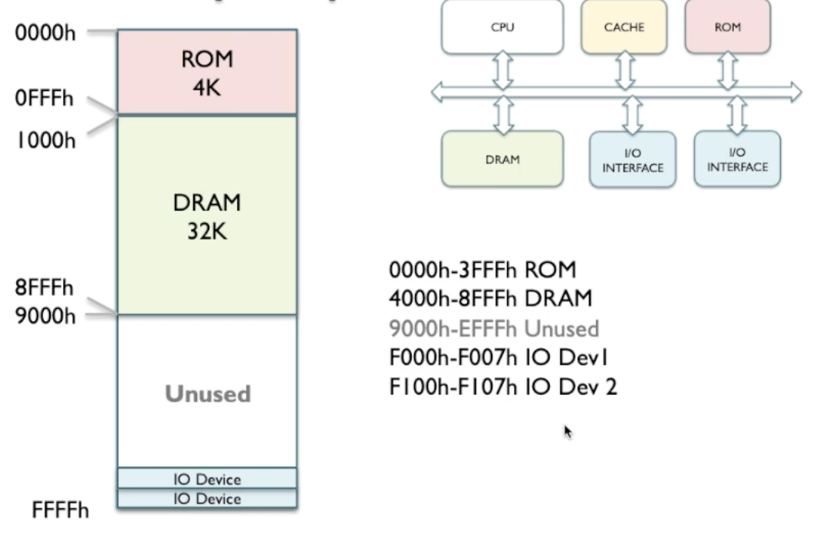
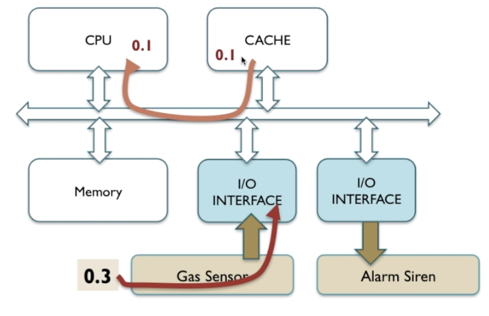
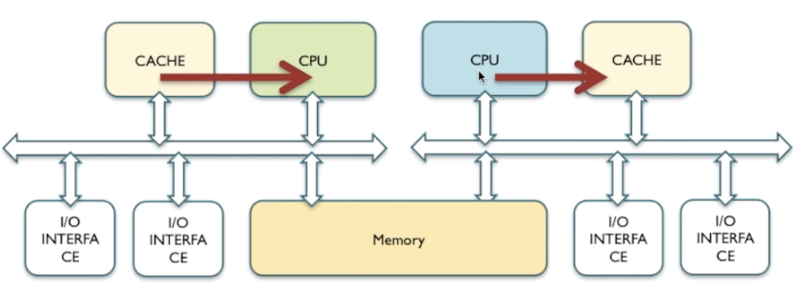

# Memory Maps

## Von Neumann refresher

- DRAM is volatile and where most data is stored.

- ROM is non-volatile and contains code that is always available for the boot up.

- Depending on architecture even the IO devices can appear simply as memory locations to the system.

## Memory maps diagram

Basically a giant box starting from 0 all the way to the highest possible memory address.

In this case 000h represents the smallest memory address and FFFFh shows the largest memory address.

FFFFh == (2^16 - 1)

h indicates hexadecimal and these are used as they are more convenient for memory maps.

IO devices have very few memory addresses to get their job done. They have very few control and data registers.

Unused memory are some memory addresses which weren't used.

# Cache coherency

The system above without cache storing a copy would just read data from the io device and report stuff correctly.

With their being cache there is a chance that the io device is reporting something different to the cache but that goes unnoticed by the cpu which is checking the cache for data.

The CPU is reading a stale cache entry.

## Shared memory multiprocessor

In a normal scenario without cache cpu 1 could modify a value in the shared memory and cpu 2 can read that accurately.

In the above diagram the cpus are just dropping data into their respective caches so communication between the cpus is hindered.

## Preventing cache coherency

Can mark segments of memory where data doesn't go into cache.