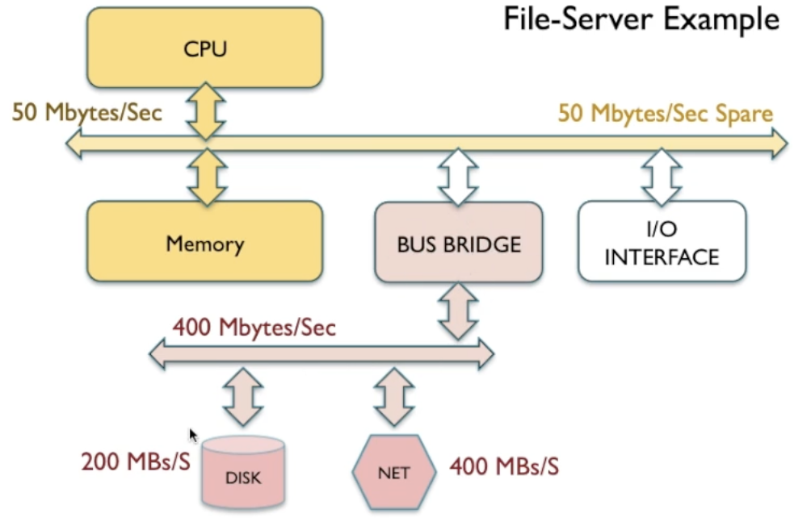
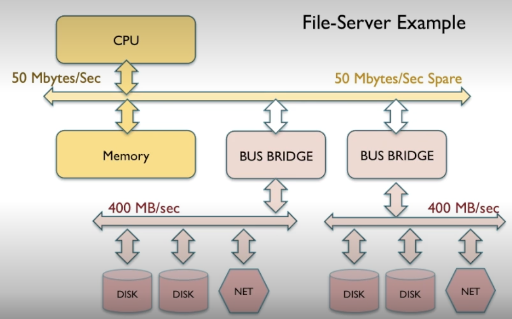

NOTE: 3.2.6 has questions for practice.

# Bus protocols and efficiency

- By default CPU is the bus master but another device can take control.
- For instance an IO device can take control of the bus to access memory.
- If two devices attempt to be master at the same time it would cause a clash and won't be permitted.
- Bus protocol causes bus efficiency.

## Example

- Simplified: The IO device provides row and column to perform a read.
- In actuality the IO has to use a clock cycle where it asks the bus master (CPU) for permission.
- The IO then has to release the bus so the CPU can become bus master again.

To perform the 1 cycle to read we first need 5 cycles of overhead.

### Efficiency

Protocol overhead = 5 cycles
payload = n cycles

total transaction length = 5 + n

efficiency = n/(5 + n)

Ideally efficiency would be 100% but no bus protocol can provide that.

As n increases the efficiency increases.

This is why burst mode is preferred since you can increase efficiency.

# Buses and Concurrency

In above image the IO device for the disk and IO device from the net are left with remainder of bandwidth.

In above example the total bandwidth of the system bus is 100MB/s

If CPU and memory need to use 50 MB/s of bandwidth it only leaves 50MB/s for the IO devices to communicate with each other.

The system bus becomes the bottleneck.

## Solution: Bus concurrency

Basically a secondary bus which could be optimised for it's role. In above image the disk and net card IO can communicate to each other with a specific high speed bus. 

In order to communicate with other components the bus bridge connects it to the system bus.

- Bus bridges may be idle if they are unneeded.

The extra disk per secondary bus allows it to keep up with the bandwidth of the network card.

Main bus only has 96MB/s thanks to the 2 bus bridges subtracting 2MB/s each. The secondary buses become 398MB/s each thanks to the bus bridge taking away 2.

Thanks to the bridges and extra buses we went from a 50MB/s capacity which got limited by I/O traffic all the way to 796MB/s capacity where the CPU has much spare bus capacity if needed without interfering with file server components.

# 🚌 Bus Protocols and Efficiency

## 1. Bus Control & Mastership

* The **system bus** is the shared communication pathway that connects CPU, memory, and I/O devices.
* **Bus master**: By default, the CPU controls the bus.

  * Other devices (e.g., a disk controller, network card) may temporarily **request mastership** when they need direct access to memory (e.g., via DMA).
* **Arbitration**: A protocol ensures that **only one master** controls the bus at a time.

  * Prevents data corruption from simultaneous access.
  * Arbitration introduces **protocol overhead** (extra cycles).

---

## 2. Bus Protocol Overhead Example

* Suppose an I/O device wants to read from memory:

  1. The device must **request permission** from the current master (CPU).
  2. This takes several **setup cycles** (overhead).
  3. Only then can the actual **payload transfer** (the data) occur.
  4. When finished, the device releases control back to the CPU.

### Efficiency Formula

* Let:

  * Overhead = 5 cycles
  * Payload = `n` cycles

$$
\text{Efficiency} = \frac{n}{n + 5}
$$

* **Key insight**:

  * For small transfers (low `n`), efficiency is poor.
  * For large transfers (high `n`), overhead becomes negligible, and efficiency approaches 100%.

👉 This is why **burst mode** (large blocks of data in one transaction) is preferred — it reduces the relative impact of protocol overhead.

---

## 3. Buses and Bandwidth Sharing

* The bus is a **shared resource** → only one transfer occurs at a time.
* Example: System bus with **100 MB/s total bandwidth**.

  * If CPU ↔ memory consumes 50 MB/s, only **50 MB/s remains** for I/O (e.g., disk ↔ network).
* Result: The **system bus becomes a bottleneck** for I/O-heavy workloads like file servers.

---

## 4. Solution: Bus Concurrency with Bridges

* A **bus bridge** connects the main system bus to a **secondary bus**, optimized for specific devices.
* Example:

  * Disk controller and network card placed on a **high-speed I/O bus**.
  * The bus bridge allows them to communicate directly, without clogging the system bus.

### Advantages

* **Parallelism**: CPU ↔ memory traffic is separated from I/O ↔ I/O traffic.
* **Specialisation**: Secondary buses can be tuned for their roles (e.g., high throughput for storage).
* **Scalability**: Adding multiple secondary buses increases overall bandwidth capacity.

### Trade-offs

* Bridges consume a small share of main bus bandwidth.
* If secondary buses are underutilised, they add complexity without benefit.

---

## 5. Example: Scaling File Server Bandwidth

* Original system bus = 100 MB/s.
* CPU+memory needs = 50 MB/s → leaves only 50 MB/s for I/O.
* Add **two secondary buses** via bridges:

  * Each bridge uses \~2 MB/s overhead.
  * Main bus: \~96 MB/s left.
  * Secondary buses: \~398 MB/s each.

➡️ Overall capacity grows from **50 MB/s I/O bottleneck** to **\~796 MB/s aggregate bandwidth**, while CPU still retains enough bandwidth.

---

## 🔑 Key Takeaways

* **Protocol overhead** is unavoidable but can be minimized with **burst transfers**.
* **Bus sharing** can cripple performance in I/O-intensive workloads.
* **Bus concurrency via bridges** allows separation of traffic → higher efficiency and scalability.
* Modern systems extend this idea with **hierarchical buses** (e.g., PCIe lanes, USB hubs) and **point-to-point interconnects** to avoid bottlenecks.