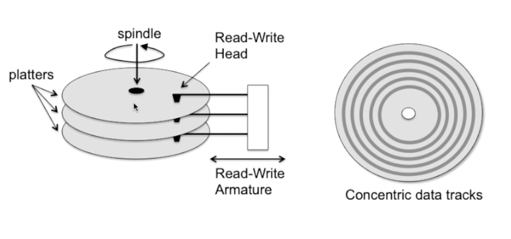
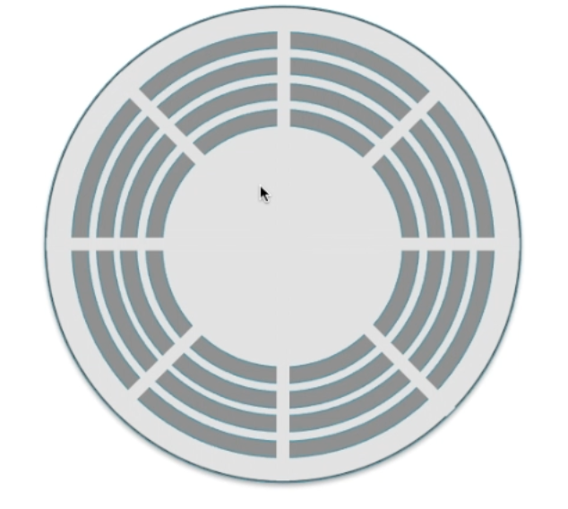
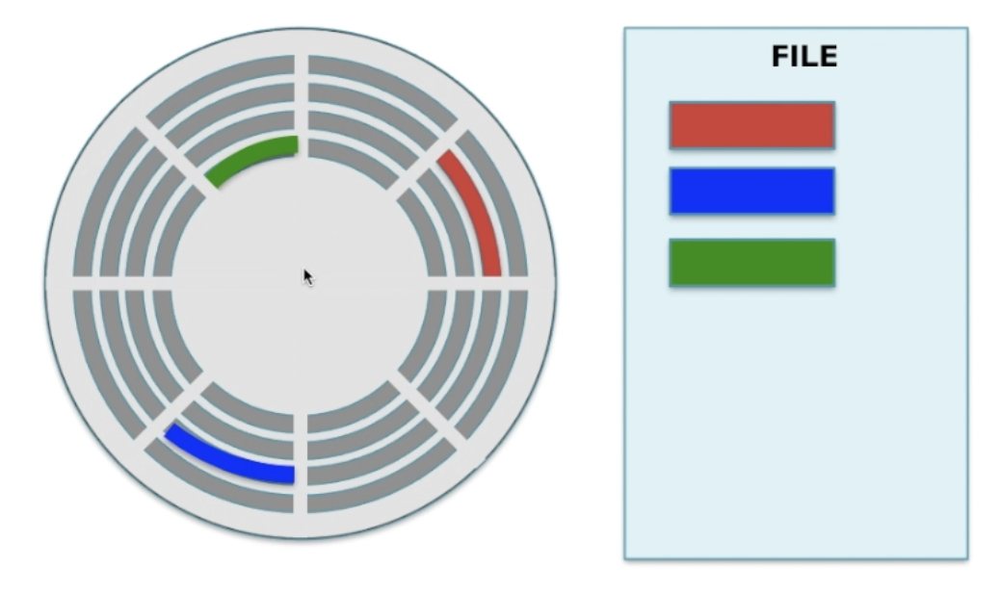
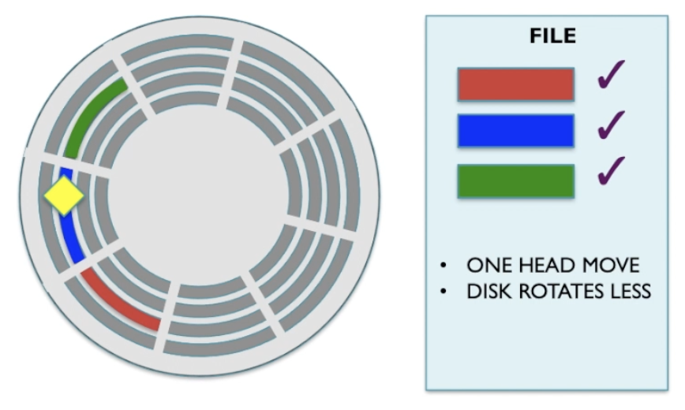
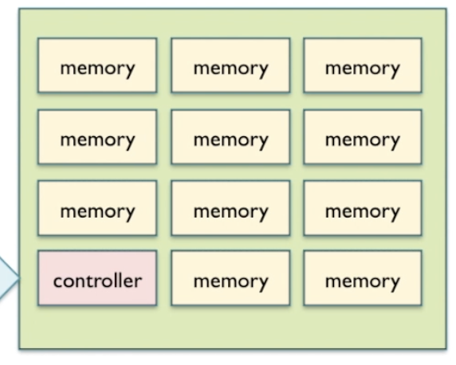

# Tracks, Sectors and Fragments

Hard disk unit: Circular platter coated in magnetic powder that allows small domains of magnetism to be recorded.

A spindle holds multiple platters. The surface area is organised into concentric data tracks (rings)

Armature allows you to read each ring.

- Each ring is a concentric track. Each track gets broken down into sectors. If each file were to be given a track it would be wasteful.

In above example the file needs 3 sectors which happen to be located on different tracks quite far from each other.

The file is **fragmented**. Fragmentation has a performance impact.

This is because you typically need multiple disk rotations and the head needs to move across multiple tracks.

On a defragmented file you just need to find the first sector and the neighbouring sectors are next which minimises head movements and you won't need extra rotations.

### Overall

Fragmented:
- Slow
- Variable time
- Creates multiple data transfers.

(You'd want 1 data transfer because protocols and overheads add up to make it inefficient)

Defragmented:
- Much faster
- Predictable timing
- Single continuous data transfer

# SSD

An SSD is a large array of memory chips as well as a controller.

The controller's job is to disguise all these memories to be a disk unit to the user and computer.

Controller translates read request into correct memory chip access.

Large files can be split across multiple memory banks. However each bank is quite large so most files will fit inside of a singular memory bank

It only takes microseconds to find a file instead of ms like within a hdd.

Because access time is so short we can flick between multiple files very quickly. On a hdd having to locate different files comes with a measurable performance delay.

SSD is good for multithreading.

## Disadvantage

Every time memory is written/erased, the memory cell eventually wears out. Caused by atomic level effects in bit levels.

Wear-leveling can improve ssd life. The controller splits writes equally among the memory blocks.

If the controller stacked writes onto a singular memory block that 1 block would wear out faster.