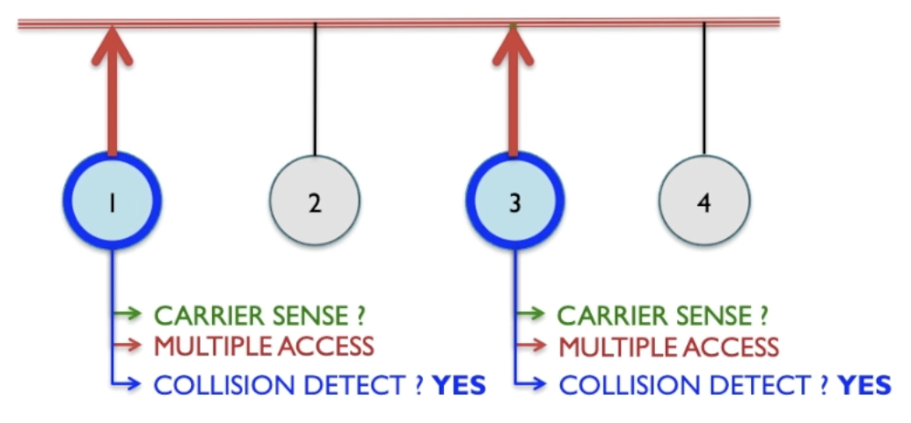

# Ethernet

Most popular wire based network tech. Uses csma/cd protocol

Carrier Sense: Detects whether signal is presence.
Multiple Access: Allows multiple devices to connect using same cable.

Collision Detection: Checks if multiple devices try and communicate simultaneously.

## Example

- Carrier Sense: Device 1 first checks if there's a signal in the cable and the cable is already in use.

If the cable is free then we enter multiple access phase.

Node 1 attempts to send data through the cable.

The hardware now needs to do collision detection. It transmits the data and checks that the data comes back the same.

If it comes back differently then there's a collision as there is likely another device using the ethernet.

If all checks are good then device 1 can send data to device 3.

### Collision

In this example nodes 1 and 3 are attempting to send something at the same time.

Node 1 and 3 check for a signal. They both detect nothing as neither has sent a signal yet.

In multiple access phase they both send out a signal and in collision detection phase they both detect there has been a collision.

After a collision has been detected they both enter back off and retry mode.

In order to stop there being a constant loop of the two devices trying to access the cable at the same time they use random numbers to delay their attempts.

If the attempts used the same time delay then nothing would get sent as they both wait on each other indefinitely.

#### Frequency

Collision frequency is quite low when there are few nodes and the chance increases with more devices.

The relationship with number of nodes and collisions isn't linear.