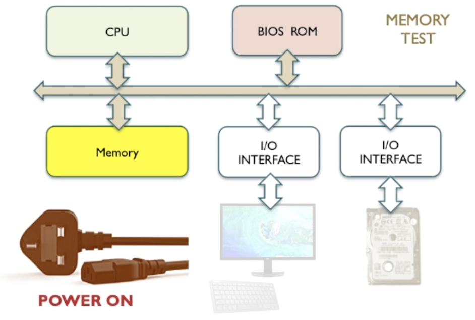
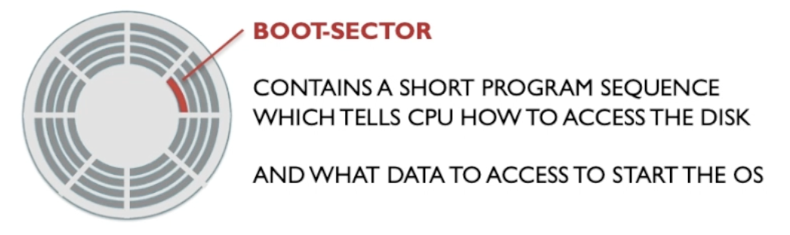
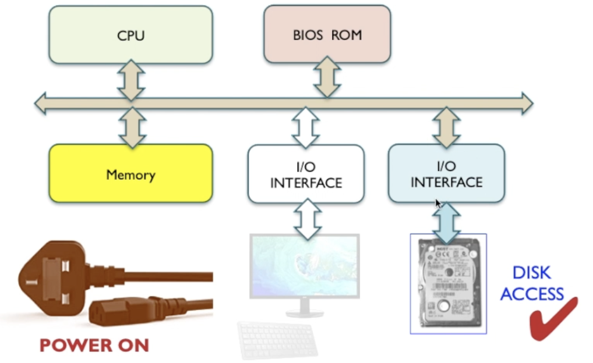

# Boot Sequence

1. Power is given to the CPU and the CPU gets boot instructions from the BIOS ROM chip.

These instructions can't exist in RAM memory as that is volatile and won't contain anything at boot. It can't exist in storage as it hasn't been initialised.

BIOS is basic operating system of the computer system. It tells the CPU what to do on boot.

2. CPU then checks what resources are available in the system. It first checks for some RAM

CPU now looks for a bootable device which could be the hard disk if setup correctly.

To make the CPU's job easier as there can be multiple different drive types and formatting options, the boot drive contains a boot sector.

Boot sector code tells CPU how to access format of the disk. Contains simple and short program sequence for this.

CPU can load the operating system and bring relevant parts to the memory.

The OS kernel gets loaded and shows how to load the other parts of the OS as needed.

OS shows the CPU how to access the other IO like keyboard and monitor.