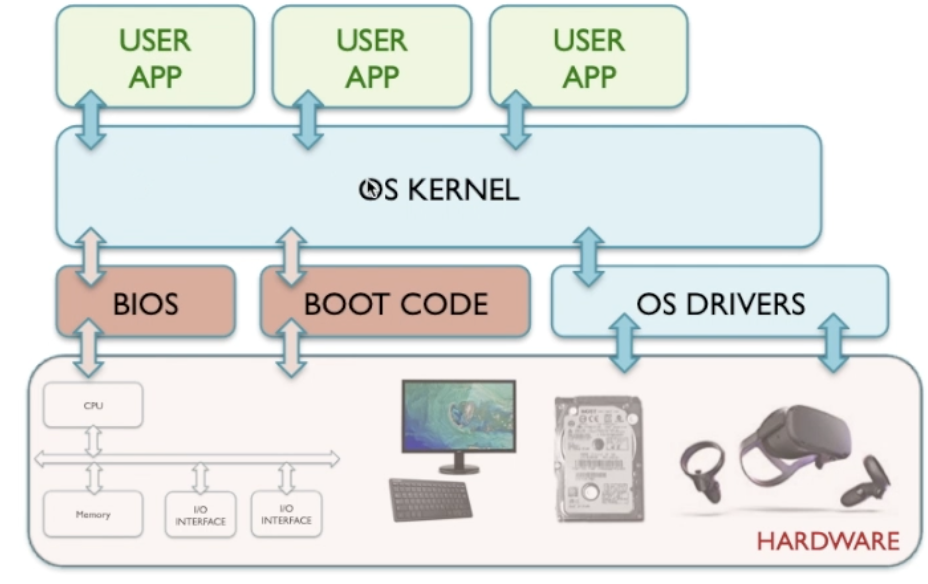

# OS and abstraction

Abstration is important as it makes it easier to fit different hardware and software together. Imagine creating an app and having to account for every version of every piece of hardware.

Operating Systems can abstract the hardware so the apps can just work.

Instead of the app speaking to the hardware directly, it asks the kernel which already knows how to use these pieces of hardware. This makes it a lot easier to write apps.

## Example:

App wants to access storage drive. It doesn't care what type of storage it is (SSD/HDD etc). It can just ask the Kernel for it.

Hardware provides driver for the OS to work with that hardware.

