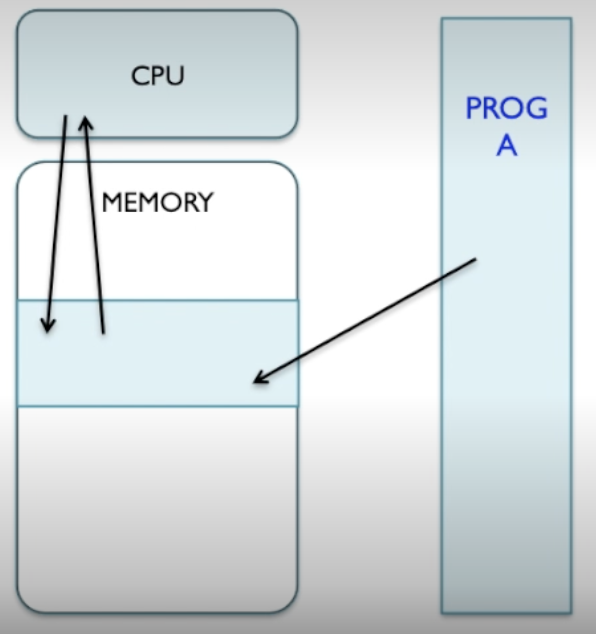
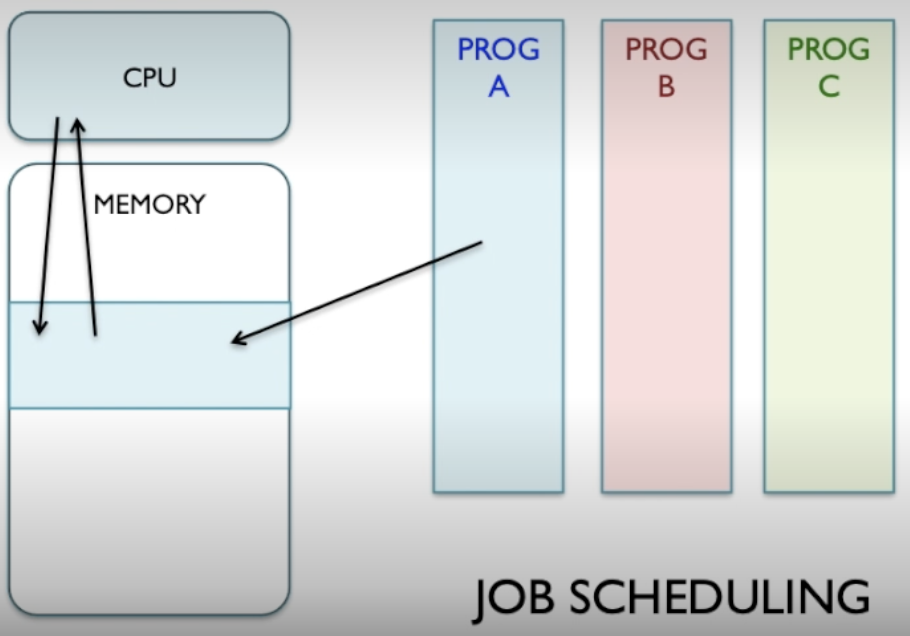
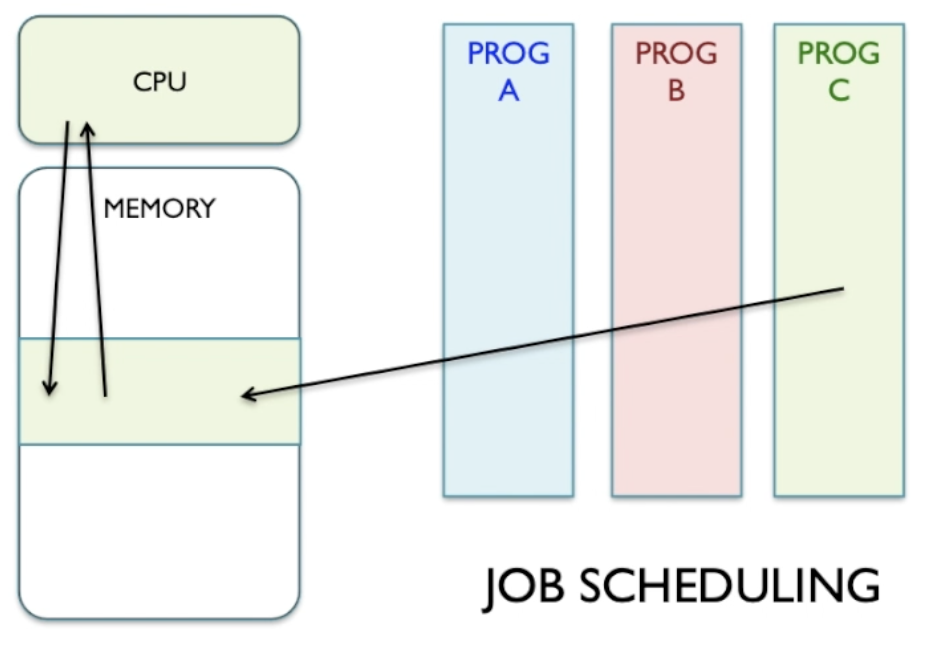
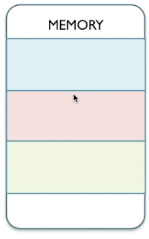
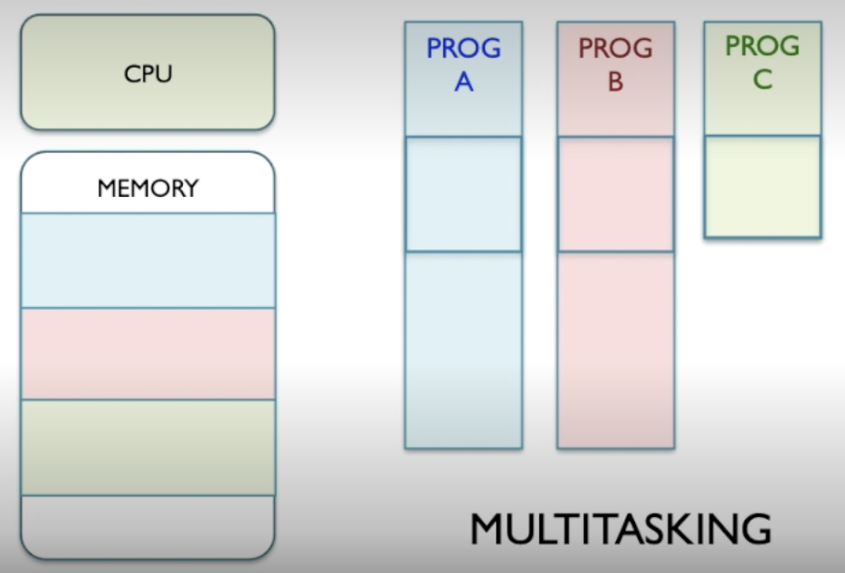
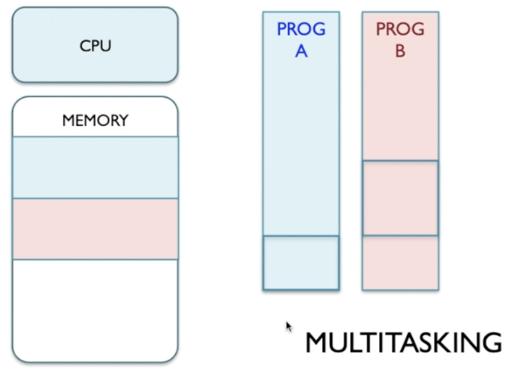
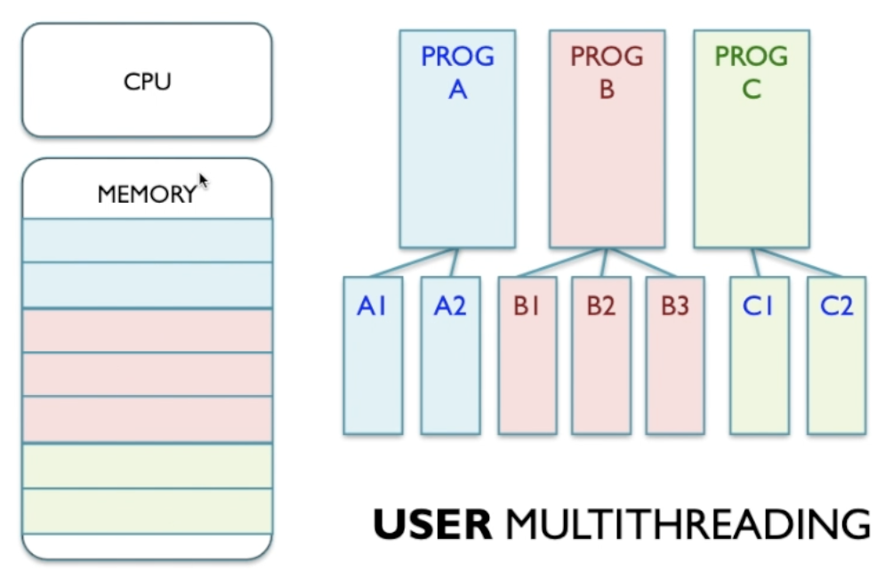
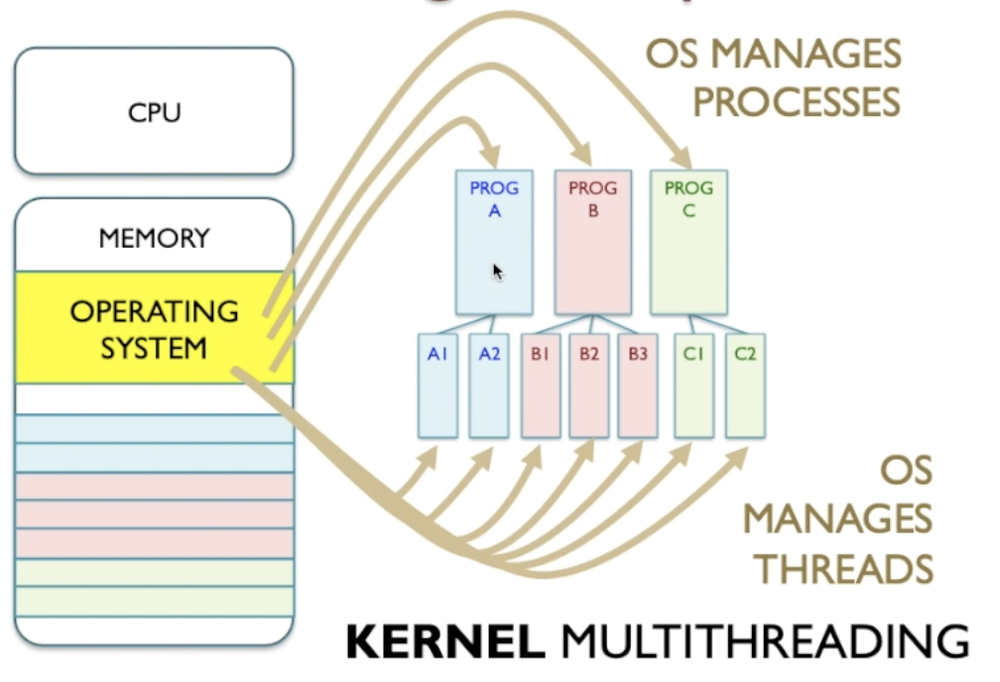
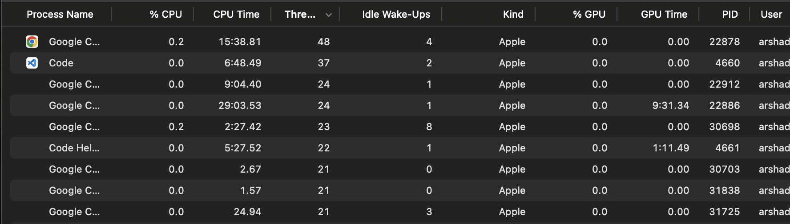

# Tasks and Processes

A process is a program that is executing on a computer system.

Processes are made of threads. Sometimes it can be a single thread.

## To run a single program

Program A gets loaded into memory where the CPU can read and execute it.

When the program is complete it leaves memory and the process terminates.

## Multiple programs running at the same time

### Job scheduling

Adminatrator can choose the order of programs to run 1 at a time. There can also be an algorithm deciding which program to run first.

First program A gets put into memory. Once executed it gets deleted from memory and then the next program has a turn.

### Multi-tasking

Where all the programs to be run all take turns but each gets partially run. To do this they all get loaded into memory and the CPU takes turns running each partially.

This makes it seem like all the programs are running at the same time.

CPU keeps a time slice of each program as execution continues.

Program C was shorter to run so if multitasking was used program C would terminate first and would get deleted from memory first.

## Multithreading Concepts

Programs are subdivided into parts called threads. For a videogame example one thread can be used for playing music and the other for interpreting player input.

You'd want these threads to happen simultaneously.

User multithreading is where the program manages its threads. This isn't prefered as it is hidden from the kernel. One program can be written to hog resources from the others which a kernel level multithreading solution would alleviate.

### Kernel Multithreading

Kernel is now able to manage threads and processes.

Now all threads conform to the same policy. The programmers now don't have to worry about multithreading as the OS kernel can handle that.

This is enabled due to API which devs can use.

