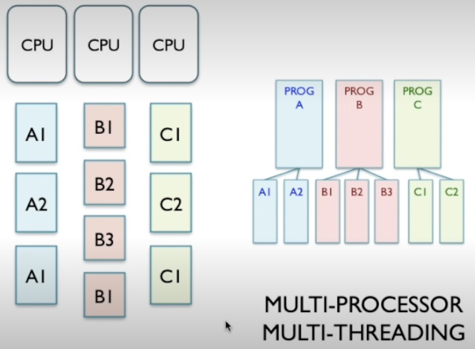
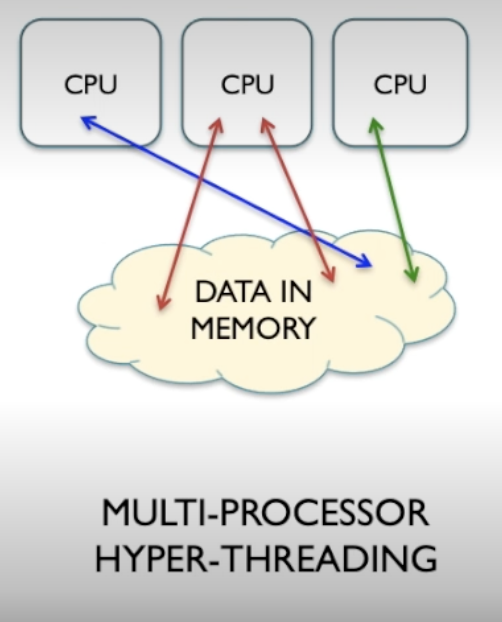
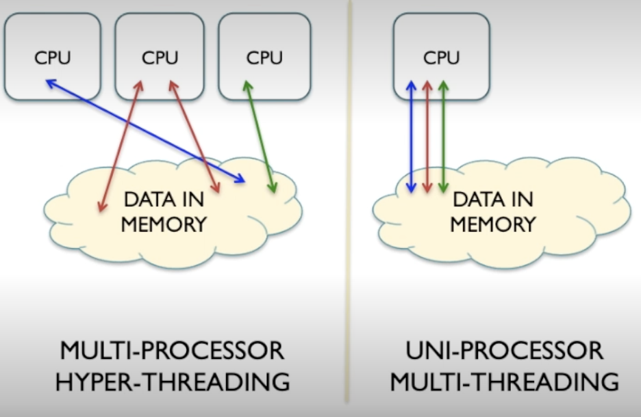

# Process Parallelism

In above image all these threads get shared across multiple CPUs. In a system with just 1 processor, that single processor would have to perform segments of each thread to give the illusion that work is being done in parallel.

## Hyper-Threading

- Simultaneous multithreading.

Where each CPU core supports multiple threads simultaneously.

Hyperthreading allows resource utilisation to be more efficient.

## Multi processor system issues

CPUs can have their own piece of memory or even have this shared memory that they can all access.

There are perhaps issues that need to be addressed where these different CPUs are trying to access the same piece of memory.

This isn't present with uni-processor multi-threading as the CPU is only doing 1 thing at a time. This is a lot easier to manage.

