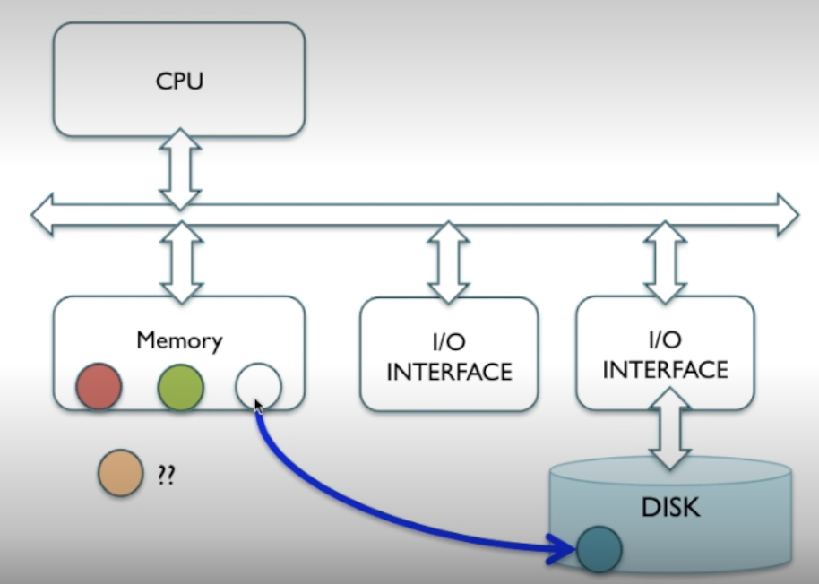
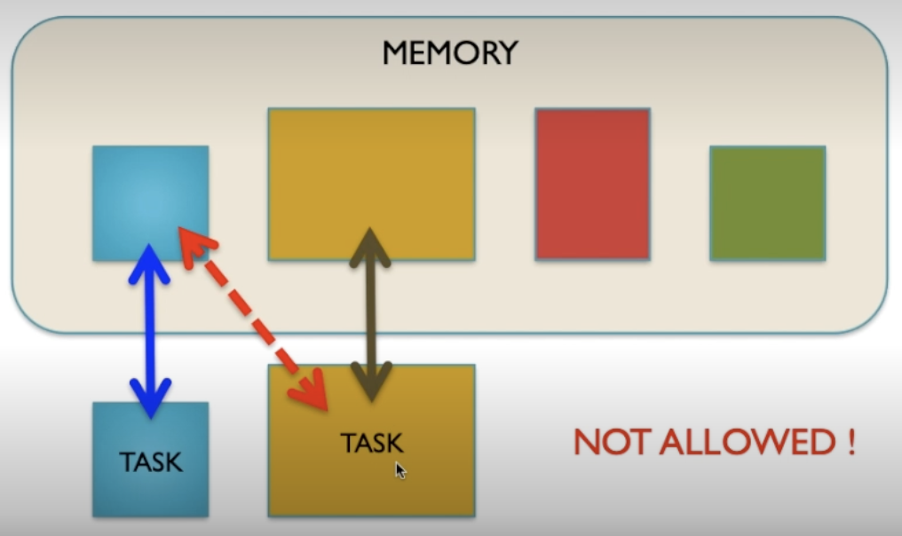
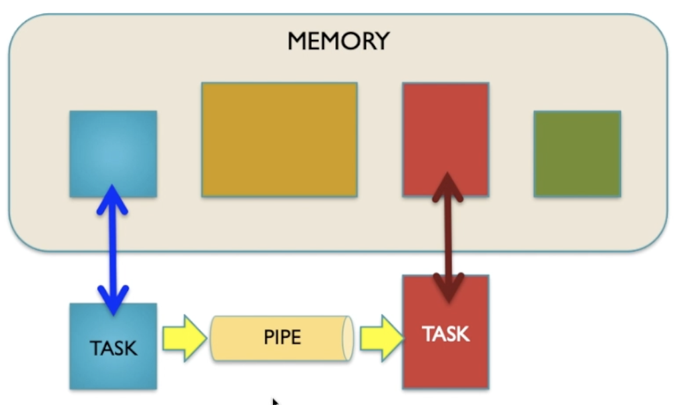
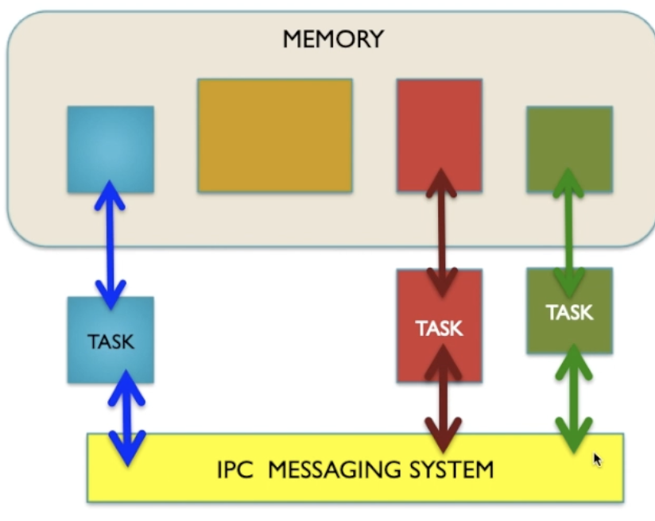

# Virtual Memory

For programs to run they need to be in memory. Lots of programs can be running at the same time so you'd need a load of ram.

You could open enough apps so that you run out of memory. You can't open another app in this state.

Modern OSs are badass and can utilise VIRTUAL MEMORY. When opening a new app an old app can be copied over as an image to the disk allowing the new app to enter.

> App moving to the disk as an image to allow a new app to enter memory

## Swap

When trying to access an app that is resident on the disk we do a swap. Doing a swap is quite a costly process as you're utilising the bus as well as physically accessing the disk can be slow in general. Especially HDD.

Excessive disk swapping is called thrashing. A system with too many apps open and not enough ram will feel sluggish swapping between apps.

In order to avoid a massive penalty when accessing an app which is resident to the disk we subdivide all the apps into pages and we swap around these pages.

The benefit of this is that an app may not need to use as many pages and we can swap that out to make the occupied space of the app less.

- Allows the system to simulate having extra ram it doesn't have. You can utilise photo editors that might require loads of gbs of ram to render each image. As far as the apps can see there's just a whole lot more memory thanks to the OS layers abstracting the difference away.

## Virtual Memory System

Page table: Keeps track of all pages.

Page fault: When a page is moved over. For instance a page is needed in memory but is resident to the disk so is moved over.

# Task privacy and isolation

Tasks aren't allowed to access each other's designated memory by default. Usually it is viruses attempting to access the memory of other apps.

## Sharing memory

### Pipe

Pipes allow data to flow from 1 app to another. You can have 2 pipes allowing bi-directional data flow.

An app can start and be unaware of the existance of a pipe. The OS can create named pipes which tasks can use.

### Queue

Messaging queues are a lot more flexible than pipes. Can have all tasks accessing this queue. Could be the case where 1 task puts something into the queue that all other tasks can then read for instance.