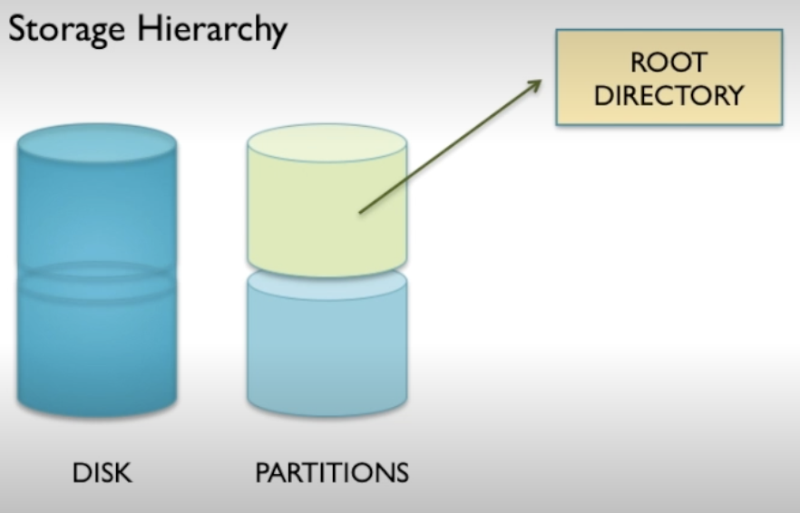
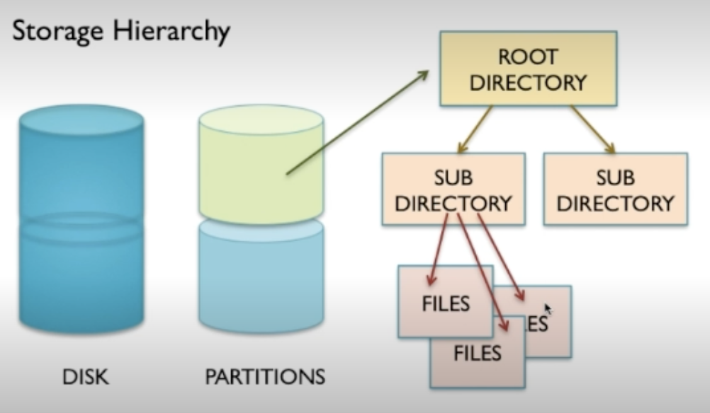
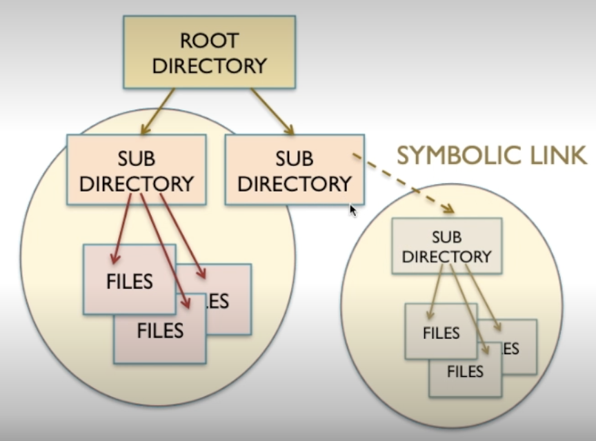
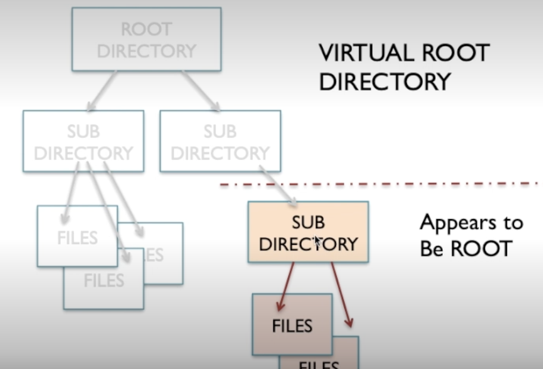

# Directory structures and features

Physically this is all takes place on a disk. Disks can be partitioned up.

The root is the top most directory of the directory structure.

Within the root directory are a number of sub directories which can be further nested a variable number of levels. Within these directories can also be files.

## Symbolic link

A symbolic link takes reference point somewhere in the file system and makes it appear like it is somewhere else.

This is similar to shortcuts on windows as they offer convenience to the user.

## Virtual Root Directory

Where the OS can make a certain sub directory appear to be the root directory. This is done for privacy. If a user was given access to the true root they can access all files even for other users by traveling down.

Instead this user can only see the virtual root as the highest level.

## Preventing directories being seen by users

You can make a directory hidden by making it unreadable to certain users. This can be useful when you're certain the user has no business there and to hide whatever it is.

