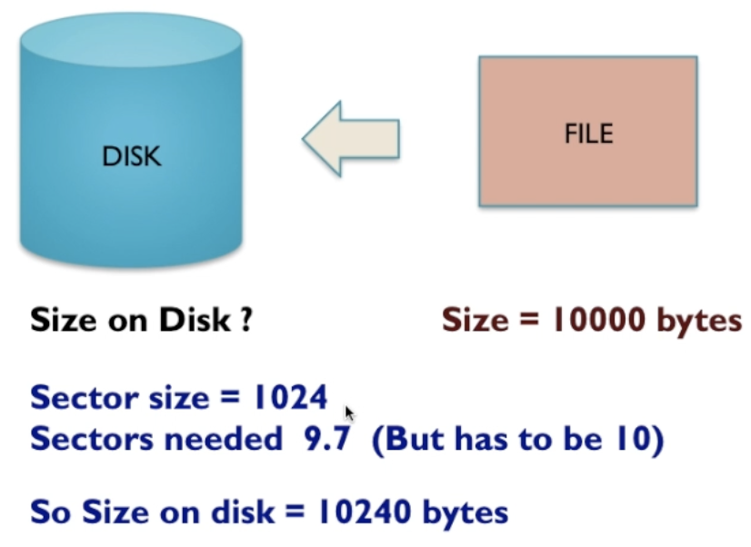

# File System Features and Management (Sections 12.10–12.18)

## File Compression

* **Definition**: Reducing the size of a file by encoding it more efficiently.
* **Goal**: Save disk space and reduce transfer times.
* **Examples**: `.zip`, `.tar.gz`, `.rar`.
* **Automatic Compression**:

  * Some file systems (e.g., NTFS) can compress files transparently.
  * To the user/program, the file looks normal, but the system compresses/decompresses in the background.
  * Saves space but adds **CPU overhead** for compression/decompression.

### Trade-offs

* **Pros**: Saves space, faster network transfers.
* **Cons**: CPU cost, slower access for frequently used files, not useful for files already compressed (e.g., JPEG, MP4).

---

## File Encryption

* **Definition**: Transforming data using cryptographic algorithms so it can only be read with the correct key.
* **Purpose**: Protect sensitive data (privacy, security, compliance).
* **File-System Level Encryption**:

  * Some file systems offer **transparent encryption** (e.g., Windows BitLocker, Linux ext4 with encryption).
  * OS automatically handles encryption/decryption when files are read or written.

### Trade-offs

* **Pros**: Security even if disk is stolen or accessed without permission.
* **Cons**: Slows down performance, requires proper key management (lose the key → lose the data).

---

## File-System Resilience

* **Definition**: Ability of a file system to recover from crashes, corruption, or hardware failure without major data loss.
* **Mechanisms**:

  * **Journaling**: Logs file changes before applying them → can “replay” or undo after a crash (e.g., NTFS, ext4).
  * **Redundancy**: Copies metadata or files across disk regions to protect from corruption.
  * **Checksums**: Detect silent data corruption by verifying integrity of stored data.

### Importance

* Prevents catastrophic data loss.
* Ensures quick recovery after power loss or system crash.

---

## Internal File Formats, Structures, and Encodings

* **File Format**: Defines how information is organized inside a file (e.g., `.docx`, `.png`, `.mp3`).
* **Encoding**: Refers to representation of data (ASCII vs. Unicode for text, lossy vs. lossless for audio/video).
* **Structure**: Determines how efficiently the file system can read/write the data.

### Impacts

* **Performance**: Binary formats are faster to parse, text formats more portable.
* **Compatibility**: Standardized formats ensure interoperability across systems.
* **Storage**: Lossy encodings (JPEG, MP3) shrink size at the cost of quality.

---

## File Format Trade-offs

* **Compression vs. Access Speed**: Smaller files may take longer to access.
* **Portability vs. Efficiency**: Text-based formats are portable but bulky; binary formats are compact but less human-readable.
* **Security vs. Performance**: Encrypted formats protect privacy but slow down processing.
* **Specialization**: Choosing a file system/file format depends on workload (e.g., database server needs fast random access, media server needs high throughput).

---

## File Management Practices

* Regular **backups** (local or cloud).
* Avoiding **fragmentation** by defragmenting or using modern file systems that reduce it.
* Applying **permissions and attributes** (hidden, read-only, executable).
* Using **metadata** (timestamps, ownership, checksums) for organization and auditing.

---

# Task Questions

**Q1: How do compression and encryption impact data security and storage efficiency?**

* **Compression**: Improves storage efficiency, but may slow down access and adds CPU overhead.
* **Encryption**: Boosts data security but at the cost of performance. When combined (compressed + encrypted files), order matters → compress first, then encrypt, otherwise encryption makes compression ineffective.

**Q2: What trade-offs matter when choosing file formats or file systems?**

* **Workload focus**: High-performance computing may favor uncompressed binary formats for speed, while backups may use compressed formats.
* **Security needs**: Sensitive environments require encrypted file systems even if slower.
* **Compatibility**: Cross-platform usage might dictate FAT/exFAT over NTFS or EXT4.
* **Efficiency**: Systems with limited storage (e.g., embedded) might prioritize compression.
* **Resilience**: Critical systems need journaling and checksums (e.g., ZFS, NTFS).

---

# 5.4.2 video notes

Disk divides files into sectors. 

Usually the final sector isn't full so there is a little wasted space at the end. On average each file takes up ~0.5 extra sectors than it technically needs thanks to unused space.

## Compression

Where we use a compression algorithm to make a file smaller.

Compression ratio measures how effectively the file has been compressed.

The algorithm used depends upon the kind of file.

### Run Length Encoding (RLE)

If there are duplicate colour values in a row they can be compressed like the above where we just state the colour and the number of duplicates instead of recording each duplicate individually.

