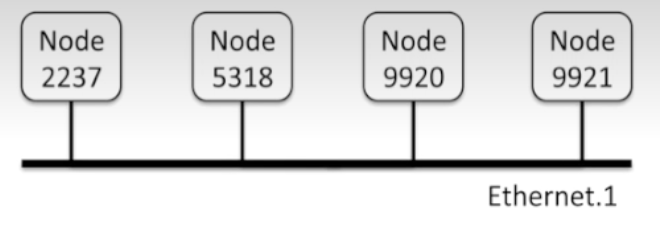
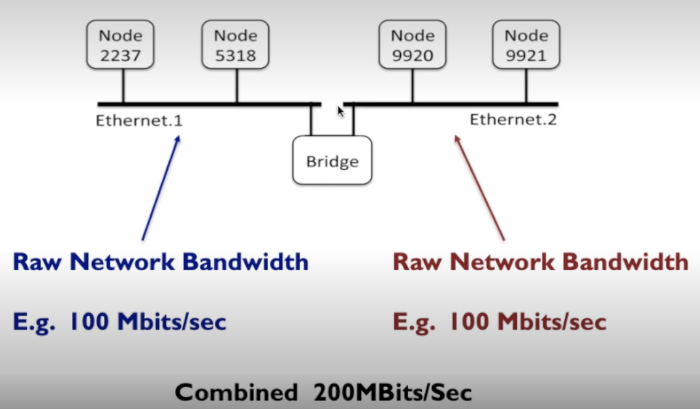
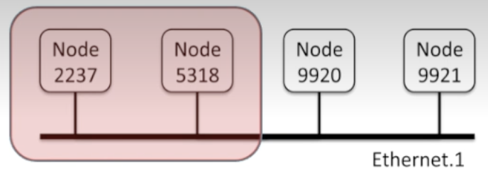
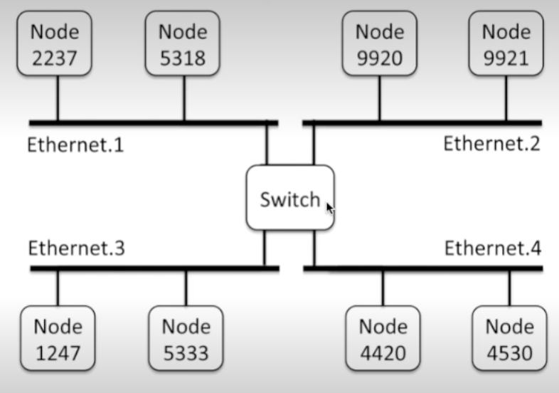
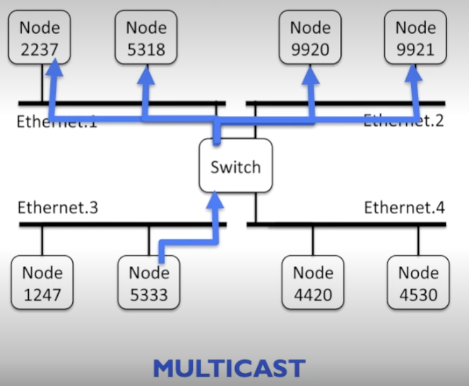

# Network Programming: Client-Server Model & Networks

## Client-Server Programming Model

* **Definition**: The foundation of all network applications (web, email, games).
* **Structure**:

  * **Server**: Manages a resource (e.g., files, emails). Waits for client requests, processes them, and responds.
  * **Client**: Requests a service, receives response, and uses/manipulates it.
* **Transaction steps**:

  1. Client sends a request.
  2. Server interprets and manipulates resources.
  3. Server sends a response.
  4. Client processes the response (e.g., displays a webpage).
* **Key insight**: Clients and servers are **processes**, not necessarily different machines. A single host may run many clients and servers.

---

## Networks as Communication Infrastructure

* To a host, a **network is just another I/O device** for data input/output.
* **Network adapter**: Hardware interface connecting host to network.

  * Uses **DMA transfers** to move data between main memory and the network.

### Hierarchy of Networks

* **LAN (Local Area Network)**: Covers small areas (room, building).

  * **Ethernet**: Dominant LAN technology (3 Mb/s → 10 Gb/s evolution).
  * Uses **segments** with twisted wires + hub.
  * **Frame**: Basic unit of communication, includes headers (source, destination, length) + payload.
  * Each adapter has a **unique 48-bit address**.

* **Bridged Ethernet**: Multiple Ethernet segments connected with **bridges**.

  * Bridges selectively forward frames only when needed → **better bandwidth usage** vs. hubs.
  * Enables spanning larger buildings/campuses.

* **Routers & Internets**: Connect different LANs and WANs into an **internet**.

  * WANs (Wide Area Networks): Span large geographical areas.
  * **Router**: Specialized computer with multiple network adapters, forwards packets between networks.

---

## Internet Protocol (IP)

* Provides a **uniform scheme** across incompatible networks.

* Two key functions:

  1. **Naming scheme**: Uniform host addressing.
  2. **Delivery mechanism**: Standardized **packet** format (header + payload).

* **Encapsulation**: Wrapping data with headers at each step.

  * Example: Client A (LAN1) sends data to Server B (LAN2) through a router.
  * Frames are re-encapsulated at each step → ensures compatibility across networks.

---

## Key Takeaways

* The **client-server model** underpins all network applications.
* Networks = hierarchical systems (LANs, WANs, routers) working together.
* **Encapsulation + IP** solve compatibility issues across diverse networks.
* Internet = global implementation of this concept with **TCP/IP protocols**.

---

✅ **Q1: Why is the client-server programming model essential?**
Because it defines a simple and universal structure for services like web browsing, email, and FTP—clients request, servers respond. It decouples resource management from usage, enabling scalability.

✅ **Q2: How do networks ensure reliable/efficient transmission?**
By layering:

* Ethernet frames for local delivery,
* Bridges and routers for selective forwarding,
* IP packets for compatibility across technologies,
* Protocols (TCP/IP) for reliability and addressing.

---

# 6.2.3 video notes

## Ethernet

All the nodes are equal and nothing is really coordinating it.

If 2 nodes attempt to use the ethernet at the same time they back off and after a random period of time attempt to use it again.

Raw network bandwidth and true network bandwith can be different.

### Bridge

Basically lets you connect 2 networks instead of keeping everything on 1 ethernet.

This is useful because some devices may hog the ethernet away from other devices. Keeping them on different ethernets but connected via a bridge means the nodes don't have to compete as much for bandwidth.

The 200Mbits/s are shared bandwidth. 1 node can't send 200Mbits/s to another. Instead 2 nodes can send 100Mbits/S each for instance.

The below case is where 2 nodes are using 98% of the bandwidth leaving the other 2 with minimal bandwidth.

### Switch

More sophisticated version of a bridge.

Allows data transfer selectively between different segments. For instance a node on segment 1 trying to access a node on segment 2 doesn't need access to segment 3/4.

No wasted bandwidth.

#### Multicast

Multicast is dope because a node may want to access multiple nodes to communicate with.

Allows you to broadcast selectively.