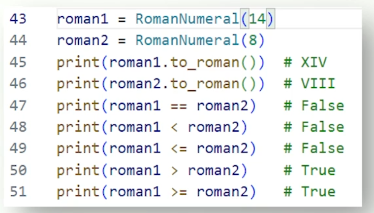

# 4.2.5 Implementing Dunder Methods

__len__

above method is used when you call len() on an object.

__repr__(self)

provides representation for debugging

__eq__(self, other)

customise qualityu behaviour

__ne__(self, other) customise inequality behaviour

__hash__(self) Enables instances to be used as dictionary keys

__getitem__(self, index)

__setitem__(self, index, value)

__delitem__(self, index)

The above 3 let us play around with our class like an array/iterable

## Using array like iterable (2 dunders for iterator protocol)

__iter__(self)

Defines how instance of class behaves when iterator is requested

__next__(self)

Let's you retrieve next element in iteration.

```py
# inside some class

# Runs when you request iteration from an instance.
def __iter__(self):
  self.current_index = 0
  return self

# called when getting next item in iteration
def __next__(self):
  # check we haven't reached the end of the array yet.
  # set current element using the current index.
  # iterate current index by 1
  # return current element
```

> Come back to fill in up top better later.

Main take away is we can get this class working like an array/list.

`for movie in movies:`

Above statement invokes the __iter__ method. We have it set to store a current index of 0.

**Next** method is invoked every loop.

## Others

__lt__(self, other) less than operator

__le__(self, other) less than or equal to

__gt__ greater than

__ge__ greater than or equal to

## Example



## Duner best practice

### Principle of least Astonishment

Classes should follow python conventions as much as possible.

Operators that do the inverse should still behave inversely. + and - should still be the opposite of each other.
- Reflexive, symmetric and transitive.
- If you define eq method then you should also define nq method

@functools.total_ordering
- Automatically generates the opposite of what dunders you have made.

- Try and avoid doing these too much as it can betray expectations. Use sparingly.

## Conclusion

Dunders are crucial for Python OOP.

Let you further customise object behaviour.

Let you write custom types that follow a lot of python. For instance enable looping through an object.

Overloading too many operators means it is harder to read and makes it harder to maintain.